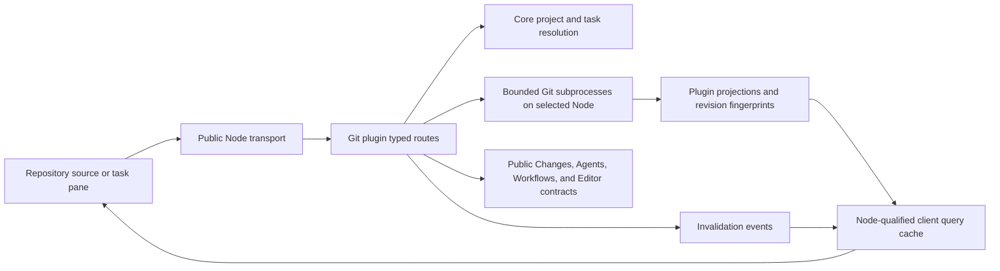

# Git client implementation handoff

This plan describes a built-in Git client for Acorn. Read it before implementing a phase: it holds
the product decisions, repository research, ownership boundaries, and acceptance requirements that
the phase files rely on.

Date: October 7, 2026. Status: planned; implementation not started. Source baseline:
`293d9bb697fe83afc8ace33fcc1f9fbade949bc8`. The exploratory implementation was reverted; these
documents do not describe shipped behavior. Recheck the source before building.

## Goal

Let a person inspect and manage a project's Git repository without leaving Acorn, and inspect or
change a task's checkout with the task context visible. Replace the separately installed worktree
manager with a compiled first-party plugin named **Git**, with plugin ID `git`, under `plugins/git`.
Use the public plugin API even though the plugin ships in the repository.

The screenshots supplied during planning establish the browsing model: repository navigation,
connected commit history, selected revision metadata, a file list, and a diff. Acorn retains its own
project selector, task lifecycle, pane layouts, UI kit, and workflow launch forms. Full feature
parity with Tower, SourceTree, or GitKraken is not a release requirement.

## Implementation order

Execute the phases in order. Each file links back to this context and states its dependencies,
deliverable, and acceptance checks. Finish a phase's observable behavior before starting the next.

| Phase | Deliverable | Dependencies |
| --- | --- | --- |
| [01: plugin and worktrees](./01-plugin-and-worktrees.md) | Repository source, task pane, authoritative worktree inventory, and safe cleanup. | None |
| [02: history and diffs](./02-history-and-diffs.md) | Paginated history, compact graph, revision details, and shared diff viewer. | 01 |
| [03: stashes](./03-stashes.md) | Inspect, create, apply, pop, and drop with task activity coordination. | 02 |
| [04: explanations and first release](./04-explanations-and-first-release.md) | Explicit AI explanations, both-host acceptance, and replacement of the external plugin. | 03 |
| [05: task and workflow launches](./05-task-and-workflow-launches.md) | Start at a commit or branch tip; attach eligible worktrees or open their tasks. | 04 |
| [06: refs, remotes, comparison, and settings](./06-refs-remotes-and-settings.md) | Branch/tag/remote management, comparison, Git settings, and opt-in fetching. | 05 |
| [07: operations and editor resolution](./07-operations.md) | Merge, rebase, cherry-pick, revert, operation controls, and editor handoff. | 06 |
| [08: three-way resolution](./08-conflict-resolution.md) | Base/ours/theirs inspection and editable conflict results with revision checks. | 07 |

The first release ends after phase 04. Later phases extend that release; do not make its release
depend on completing every operation or conflict tool. [Refused alternatives](./refused.md) records
the scope boundaries and their reasons.

## Reference screenshots

Copies of the supplied images are retained beside this plan so a future developer can inspect them
without the original chat or the task's attachment directory. Treat them as interaction references,
not Acorn mockups or evidence of another product's complete functionality.

| Reference | What it shows | Acorn interpretation |
| --- | --- | --- |
| [1: light history](./screenshots/01-history.png) | Navigation, connected history, commit metadata, and changed files. | Repository source with history list and selected revision detail. |
| [2: light stashes](./screenshots/02-stashes.png) | Named stashes, origin branch, metadata, and expanded diff. | Repository stash list; the same revision detail and diff components. |
| [3: branch history](./screenshots/03-branch-history.png) | Grouped branch names and a branch-specific commit list. | Ref filter in the repository view; task branch is the pane's default filter. |
| [4: Git identity](./screenshots/04-identity.png) | Author name and email confirmation. | Acorn Git settings with effective values, origins, and explicit write scope. |
| [5: dark history](./screenshots/05-history.png) | Repository/branch selectors, WIP, graph lanes, and worktree/stash groups. | Keep Acorn's project selector; link working changes to the Changes pane. |
| [6: dark diff](./screenshots/06-diff.png) | Selected file diff, revision description, and file tree. | Use Acorn's diff document/viewer; omit working-directory actions on historical files. |
| [7: dark graph detail](./screenshots/07-graph-detail.png) | Connected graph, ref labels, selected commit, and changed files. | Compact lanes beside commit rows, with a shared selection and file detail. |
| [8: dark stash detail](./screenshots/08-stash-detail.png) | Stash selected in history, named stash list, and explanation action. | Dedicated stash navigation and explicit **Explain stash** action. |

Do not copy the reference clients' extra window chrome, trial notices, hosting features, or generic
Undo/Redo toolbar. Use Acorn's three-dot row menus for actions such as starting a task or workflow.

## Two surfaces

### Repository source in the left rail

Register a project-scoped **Git** source, visible for Git projects. The host's top-left project
selector chooses the repository on the selected Node. Repository navigation contains **History**,
**Stashes**, and **Worktrees** in the first release. Add **Branches**, **Tags**, **Remotes**, and
**Compare** in phase 06. Link to the Git settings page rather than embedding a second settings form.

The source's list region is section navigation. The main region uses the kit's list/detail split
for the section's item list and selected detail. History shows ref filtering, search, a bounded
commit list, and connected graph lanes. Details show the message, author and committer, dates,
object ID, parents, refs, changed-file summary, file list, and lazy diff. A stash uses the same
detail surface with stash-specific metadata and actions.

The repository source is for the selected repository, not the old plugin's workspace-wide scan.
Changing project cancels stale reads and clears selection that belongs to the previous repository.
Preserve selection by stable object identity on refresh; never move selection to a different
stash because its list index changed.

### Task pane in the right rail

Register a separate **Git** pane using the host's `list-detail` layout. Its model is owned once per
task. Default to history reachable from the task's branch, show checkout/HEAD identity, and provide
an explicit link to the repository view. A detached or missing branch needs a named state and a
usable HEAD or repository fallback; do not silently change the recorded task branch.

Show repository stashes in the task pane, including their origin branch. Stashes are repository
state, so an origin branch label does not restrict where a stash can be applied. The task pane's
mutation target is always that task. The repository source asks the person to select a target task
before a checkout mutation.

Keep **Changes** as the owner of working files, staging, unstaging, discarding, and committing. Git
provides history, stash management, metadata, and operation orchestration. Link to Changes for WIP;
do not build another commit composer. Reuse Changes' remote actions and hooks where applicable.

### Both hosts

Desktop and terminal support the first release. Desktop draws compact connected lanes beside the
commit rows, rather than a draggable workflow canvas. Terminal draws the same commits, refs,
selection, actions, and parent relationships as keyboard-operable rows. Color alone cannot identify
relationships or state. Every menu action must be reachable through the collection keyboard model.

Use the closed kit: `Rows`, `Row`, `TreeRow`, `RowActions`, `Menu`, `Toolbar`, `ListDetail`,
`DiffPane`, `Modal`, `SettingRow`, and their terminal projections. A plugin must not draw its own
DOM, SVG, split handles, or focus system. Add the small history geometry component to the shared
kit when required, with a terminal projection and neutral row/edge inputs. The workflow `Graph`
canvas is precedent for host-owned drawing, not the desired commit-history layout.

### Visible states

Distinguish loading, empty repository, no search results, no stashes, unmapped project, unavailable
Node, missing checkout, failed Git command, truncated content, and stale selection. Preserve useful
read data on a refresh error with a stale-data indication. A partial mutation must refresh Git
state and expose the actual result, even when the command exits unsuccessfully.

Show the Node, repository, task, branch, and relevant revision in action dialogs. Keep typed input
when a request fails. If the active Node/project changes while a dialog is open, retain its original
target identity and require reopening before a write. Refresh on reconnect, explicit refresh, and
relevant plugin or worktree events; read refreshes do not fetch from a remote.

## Source baseline and ownership

These locations were inspected on October 7, 2026. Line references are orientation aids for the
baseline, not promises that the file remains at that line.

| Owner | Source and precedent | What Git should reuse or extend |
| --- | --- | --- |
| Plugin composition | `apps/node/src/composition/plugins.ts`, `apps/desktop/src/client/plugins.ts`, and `apps/tui/src/roster.ts` | Register the compiled plugin on Node and both clients; update corresponding app dependencies and roster tests. |
| Public facade | `packages/plugin-api/src/node.ts`, `packages/plugin-api/src/client.ts`, and `packages/plugin-api/src/ui/index.ts` | Import public services, registries, transport, and UI; extend only demonstrated missing seams. |
| Source layout | `packages/client-core/src/host/registries/sources/sources.ts`, line 40 | Declare `projectScoped`, `requiresGitProject`, routes, and list/detail regions. |
| Pane layout | `plugins/changes/src/client/paneContribution.ts`, line 15 | Use a task model and declared list/detail regions; the host owns the split and collapse. |
| Shared drawing | `packages/client-core/src/kit/components/content/Graph.tsx`, line 56 | Put graph pixels and keyboard ownership in the kit, with terminal support in `apps/tui/src/kit/ui.ts`. |
| Working Git | `plugins/changes/src/server/routes/localGit.ts`, line 66, and `plugins/changes/src/server/localDiff.ts`, lines 331–365 | Preserve remote command semantics and the Changes capability/route owner. Extract a public contract before consuming another plugin's service. |
| Task creation | `packages/client-core/src/features/tabs/taskDraftStore.ts`, line 20, and `packages/node-core/src/server/routes/projects/tasks.ts`, line 188 | Reuse draft forms, creation, branch reservation, attachment, setup, navigation, and archive. |
| Starting point | `packages/node-core/src/server/worktrees/taskBranch.ts`, lines 32–100 | The baseline supports `baseBranch`, captures its commit, reserves a branch, and creates the worktree lazily. Add pinned commit support here. |
| Task wire contract | `packages/protocol/src/transport/api/projects.ts` | Extend TaskSeed and availability consistently; do not bypass core with raw worktree creation. |
| Agent activity | `plugins/agents/src/contract/lifecycle.ts` and `plugins/agents/src/contract/wire.ts` | Read public turn/session projections; agents retain authority over their state and admission. |
| Workflow activity | `plugins/workflows/src/server/runs/runner.ts`, lines 253, 356, and 473, and `plugins/workflows/src/node/schema.ts` | Workflows owns start/retry/recovery and nonterminal run state; publish a narrow projection instead of reading its tables from Git. |
| Workflow UI | `plugins/workflows/src/client/StartFromItemHost.tsx` and `plugins/workflows/src/client/editor/startRequest.ts` | Reuse definition selection, required inputs, start, and run navigation through an owner-provided contract. |
| Settings | `packages/client-core/src/host/registries/shell/settings.ts`, line 45 | Contribute Git pages with scope, Node switching, sections, search terms, and standard save feedback. |
| Diff rendering | `packages/plugin-api/src/ui/diff.ts` and `packages/diff-document` | Serve historical revisions through the segmented diff document and source port. |

The external source inspected was `/Users/jamesmacfie/Source/acorn-worktree-manage`, not a folder
inside Acorn. Its manifest identifies `worktree-manager` and a source named `worktrees`. Its Node
entry lists every repository in the routed project's workspace, associates tasks by worktree path,
and uses bounded batches for status and last-commit reads. Removal re-reads the Git roster, rejects
the main checkout and task-owned worktrees, and requires a paired device. Pruning is repository-wide.
Retain those protections; revisit path canonicalization and force removal rather than copying them.

Read [architecture](../../architecture-overview.md), [plugin API](../../plugins/plugin-api.md),
[collaboration](../../plugins/collaboration.md), [closed kit](../../ui-design/closed-kit.md),
[pane layouts](../../panes/layout.md), [state ownership](../../state-ownership.md),
[diff documents](../../diff-rendering/document.md), and
[task worktrees](../../workspaces-and-tasks/worktrees.md) before implementation.

## Data flow and contracts



Git is the authority for commits, refs, stashes, operation markers, worktree registration, and
checkout status. Core is the authority for projects, tasks, branch reservation, setup, and archive.
Plugins own their activity, workflow definitions/runs, model generation, and editor buffers.
Do not mirror the Git object database or stash list into Acorn's task tables.

Use plugin-owned typed request/response contracts and runtime validation. Keep route registration
and plugin lifecycle in thin entrypoints; put repository reads, revision reads, stash operations,
metadata writes, and conflict writes in focused server modules. Promote only genuinely shared
contracts into protocol. Cross-plugin imports are restricted to the owning plugin's public contract.

Routes resolve a project or task ID on the selected Node. A client cannot supply an arbitrary cwd.
Repository-wide reads and writes in this feature are paired-device actions; do not grant a task
credential access to other repositories or add agent mutation tools. Scope all query keys,
subscriptions, caches, request cancellation, and retained selections to Node and repository/task.

### Read contracts

Return commit identity, all parent IDs, author/committer metadata, message, refs, and a continuation
cursor. Support a ref filter and bounded message, author, or hash search with explicit search
semantics. Resolve refs to immutable IDs for an observation. Pagination must remain consistent if
refs move; expire or restart a cursor instead of silently duplicating or skipping commits.

Use NUL-delimited Git output for paths and records. Bound subprocess time, bytes, process
concurrency, history pages, file topology, patches, search, and resident caches. Return the limit and
omission reason when data is incomplete. Start with a 100-commit page and tune measured limits
against Runn and Acorn; a large repository must not produce an unbounded graph or eager patch load.

Revision detail is keyed by immutable object IDs and an explicit comparison base. A normal commit
defaults to its first parent; a root commit compares with the empty tree. A merge displays all
parents and permits an explicit parent comparison. Read changed-file topology first, then only the
requested diff segments. Handle renames, deletion, executable-mode changes, binary files, unusual
path names, and missing objects. Historical file views remain read-only.

Reuse the diff source port for topology, segment reads, search, and gap expansion. Cache parsed
documents on the Node with a byte budget and revision keys; keep client resident segments bounded.
Cancel work and discard responses when the route, selection, task, or Node no longer matches.

### Mutation contracts

Classify writes by their effect, and enforce the classification on the Node:

| Effect | Actions | Target and admission |
| --- | --- | --- |
| Repository metadata or network | Fetch; stash drop; branch/tag/remote/upstream management; Git settings; eligible worktree cleanup. | Selected mapped repository; validate ownership, fresh refs, and destructive intent. |
| Task checkout | Stash create/apply/pop; pull; merge/rebase/cherry-pick/revert; operation controls; conflict save/stage. | Explicit active task; authoritative busy check and coordinated checkout admission. |
| Task lifecycle | Create from a revision, attach a worktree, or archive its task. | Core task APIs and lifecycle; Git does not implement a second task manager. |

Serialize cooperating metadata changes that can invalidate a selection. Check object IDs, ref names,
path membership, roster revision, task ownership, and operation state immediately before a write.
Use argument arrays, literal pathspecs, and path confinement. Never shell-interpolate supplied names,
accept option-like revisions, or run external diff/text-conversion helpers to render content.

Branch rename/delete must reject task-reserved or checked-out branches, including aliases where two
mapped projects refer to the same Git repository. A worktree removal must re-read the roster and
ownership; reject main, locked, and task-owned paths. Route task-owned cleanup to archive. Git prune
can clear several registrations, so inspect every affected missing entry and block if any belongs
to a task. Cleanup never force-deletes a dirty task checkout.

Git can fail after changing files or refs. Report structured success, refusal, conflicts, or partial
failure with useful stderr and observed post-operation state. Do not label a failed command a
rollback. Refresh both Git and Changes after checkout writes, and refresh task/worktree ownership
after lifecycle changes.

## Task activity and admission

An idle agent session does not block checkout changes. Queued, dispatching, or active turns do;
permission/question waits within a live turn and cancellation that has not settled remain busy.
Workflow runs in `running`, `gated`, or `cancelling` state block checkout changes, including a run
waiting at a human gate or for children. Unknown activity state fails closed for checkout writes.

Checking activity and then starting Git is insufficient: an agent or workflow can start between the
two. Introduce a small Node-owned admission coordinator shared by Git mutations and owner-managed
work admission. Agents and Workflows publish authoritative activity readers and participate when
they queue/start/retry/resume/recover work. Core coordinates admission without importing their
private models. This is a new seam because Git and both runtimes need the same exclusion rule.

Key exclusion by canonical checkout identity, include all tasks that share that checkout, and
coordinate repository ref writes separately where needed. Avoid a global lock held during all
network or model calls. Recheck task activity and ownership under the admission guard, execute the
mutation, observe its outcome, then release in `finally`. Do not hold admission while running a
workflow tick that may enqueue an agent through the same coordinator. Cover lazy checkout creation
and task setup/archive races as well as initialized worktrees.

The refusal names the task and active work and offers navigation to its owner. Git does not kill
agents, cancel workflows, or silently retry after they stop. External terminals and Git clients do
not participate in Acorn's coordinator; freshness checks reduce stale writes but cannot promise
cross-process exclusion. Surface Git lock failures and externally changed state.

## Stash behavior

Both surfaces list repository stashes with message, creation time, origin branch when available,
base commit, immutable stash object ID, and current selector. Origin branch is descriptive metadata
and may be absent or no longer exist. Stash detail includes tracked changes and captured untracked
files; do not treat its index/untracked parents as ordinary history merges.

Creation uses an explicit message, tracked files by default, and opt-in **Include untracked** and
**Keep staged changes**. Ignored files are excluded. Apply/pop offer **Restore index** explicitly.
Apply preserves the stash; pop removes it only after successful application. A conflicting pop
retains the stash and leaves conflicts to resolve. These semantics follow the
[Git stash manual](https://git-scm.com/docs/git-stash).

Refuse apply/pop on a dirty target checkout. Tell the person to commit or stash their changes in
Changes; do not automatically stash, reset, discard, or clean. Creation refuses an unresolved Git
operation or conflict. Drop requires destructive confirmation and needs no checkout target.

Selectors such as `stash@{0}` shift when the list changes. Carry the selected object ID, selector,
and a compact roster fingerprint; revalidate all three before a destructive action. Prefer an
immutable object for application where Git supports it. Drop/pop must never act on a different
stash due to an index shift; return a stale-selection refusal and require refresh. Test duplicate
stash objects, external list changes, and conflicts. A fingerprint does not make external reflog
writes transactional, so document the remaining cross-process limitation rather than hiding it.

## AI explanations

Ship **Explain commit** and **Explain stash** in the first release. Generation is an explicit user
action with Acorn's model/backend picker; it never runs on selection or refresh. Use Node model
services and the shared picker/default selection. Do not create an agent session to explain a diff.

Provide bounded revision metadata, file summaries, and selected patch text. State omitted files,
binary content, or truncated context in the result; do not imply that the model inspected it. Treat
messages and file text as untrusted prompt content. Show generating, cancellation, unavailable
backend, provider error, empty result, and retry states. Cancel on target/Node changes and discard
late output. Keep an explanation associated with the revision and chosen model, separate from Git
metadata and the task transcript. Generation does not acquire a checkout mutation lock.

## Launching tasks and workflows

Commit and branch rows offer **Start task here** and **Start workflow here** in their three-dot menu.
Resolve a branch tip to an immutable commit before opening the launch form and display that pinned
starting point. Default to a new isolated branch/worktree; do not check out the chosen revision in
the current task. Reuse the core task draft form with title, branch, setup choice, and base seed.

Extend core TaskSeed, route validation, availability checks, and branch creation with `baseCommit`.
Accept one of `baseBranch`, `baseCommit`, or eligible worktree attachment. Validate the object on the
Node, reserve the branch, and capture the base before saving. Preserve derived-name deduplication,
exact-name refusal, lazy worktree creation, setup evidence, and branch cleanup on failed task save.
No detached task is required to start at a historical revision.

For a free registered worktree, offer **Attach to task** through core's attachment path. Show
**Open task** when it is owned. Revalidate ownership on submit; do not accept an arbitrary folder.

Workflows owns definition selection, required-input collection, validation, start idempotency, and
run navigation. Expose a narrow owner contract to request that flow from Git. Check its host mounting:
the baseline start host is not a general guarantee that every source or terminal can open it.
If task creation succeeds and workflow start fails, retain the task, show the failure, and offer
retry on that task; never create another task on each retry or silently archive the first.

## Refs, comparison, and Git settings

After the first release, support local/remote branch browsing, create/rename/delete, upstream
assignment, lightweight/annotated tags, and remote add/remove/URL editing. Validate names and remote
URLs on the Node and refuse executable transport helpers supplied through a URL. Ref updates never
switch a task's recorded branch. Repository fetch updates metadata without requiring a task.

Compare two pinned refs/commits with direction clearly shown. Offer direct tree comparison and
merge-base comparison as named modes; reuse revision topology, file list, diff, and bounded search.
Branch task/workflow launches use the same pinned-start flow as commit rows.

Add Git pages to Acorn settings:

- Effective author name/email and their config origin. Writes explicitly choose repository-local
  or Node-user-global scope; global means the user account on that Node, not this client device.
  Read back values after a write, including overridden values and partial failures.
- Pull strategy with **Fast-forward only** as default and **Rebase** as an explicit choice. Apply
  it through the Changes owner rather than creating different pull semantics in two views.
- History graph visibility and diff presentation using device preferences/shared viewer settings.
- Auto-fetch off by default; when enabled, default to five minutes. The Node owns scheduling and
  per-repository timing. Deduplicate aliased projects, avoid overlapping fetches, stop on disposal,
  and expose failure/last-success state. Client mounts and read refreshes never start a fetch.

Reuse Changes' push flow, before-push hook, and `--force-with-lease` behavior; do not add bare force
push. Account for auto-fetch changing remote-tracking refs when evaluating lease expectations.
Document the effective protection and test a remote that advances before a push.

## Operations and conflict handling

Add task-targeted merge, noninteractive rebase, cherry-pick, and revert. Display the target task,
branch, and source revision before submission. Refuse dirty targets, active work, unresolved
operations, unsupported merge-commit arguments, or changed preconditions with an actionable reason.
Do not silently switch a task branch or infer a cherry-pick/revert mainline parent.

Read operation markers and unmerged index entries from Git, not a client state flag. Provide
continue/abort and skip only where Git supports it. A restart or an operation started in a terminal
must reconstruct the same banner. A conflicted stash is an unresolved index without necessarily
having a merge/rebase operation marker; do not offer a fictitious stash **Continue** or **Abort**.

Phase 07 opens conflicted files in Editor and links to Changes for staging. Phase 08 adds an Acorn
three-way surface: base, ours, theirs, and an editable result. Label the roles using the operation
and index stages; during a rebase, the meaning is not necessarily the person's intuitive branch
labels. Keep the source sides read-only and the result draft owned by the editor/document model.

Saving and staging requires a fresh conflict revision covering index stages and working result.
Reject a changed file/index, escaped path, binary or oversized unsupported input, or unresolved
markers before replacing the result. Respect dirty editor buffers, save failures, file deletion,
and modify/delete conflicts. Supported text resolutions can save then stage explicitly; unsupported
cases retain editor/terminal guidance. Continuation is a separate operation action, never a side
effect of opening or saving a file.

## Replacing the external plugin

After phase 04 acceptance, retire the installed `worktree-manager` registration on each affected
Node through Acorn's plugin management flow. Verify the installed ID rather than matching its
display title. Keep the external source checkout and Git data; do not delete a repository, worktree,
task, stash, or plugin data as part of replacement. Use non-purging removal/disable behavior.

The built-in plugin is independently registered as `git`; the old `worktrees` source/layout state
must not be confused with a task pane. Preserve unrelated plugin activation preferences. Document
navigation to **Git > Worktrees** and test a Node with no external plugin installed, one with it
installed, a remote Node, and the built-in Git plugin disabled. No silent installation or removal
on other Nodes is implied by replacing a plugin on one Node.

## Verification strategy

Use temporary real Git repositories for command behavior. Cover roots, merges, renamed/binary
files, NUL-safe path parsing, detached/unborn HEAD, moved refs during pagination, repository aliases,
locked/missing/dirty worktrees, stash options, and stale selectors. Use a local bare remote for
fetch/pull/push and diverged-history tests. Never mutate a contributor's real repository to test.

Use controlled promises to prove both orderings of agent/workflow admission versus a Git write.
Include queued work, live permission waits, gated workflows, retries, restart recovery, setup,
archive, shared checkouts, failure release, and absence of nested-admission deadlocks. Route tests
prove paired-device gating, cross-project refusal, validation, and confined writes.

For client tests, verify observable selection, cancellation, action targets, preserved failed input,
lazy diff requests, workflow retry retaining its task, and keyboard actions. Avoid tests that repeat
an enum or mirror a parser implementation without realistic Git output. Recheck public facade,
plugin roster, route, UI vocabulary, terminal support, and dependency goldens when those contracts
change; regenerate only affected snapshots after understanding their diff.

Use the supported Node version from root `package.json`, install with the frozen lockfile, and wait
for task setup where configured. During development, use `pnpm test:focus` on the changed behavior.
At each phase's handoff, run `pnpm lint`, affected package suites and their direct consumers, and
`pnpm --filter @acorn/arch-tests test`. The Git package and test filenames are created during
implementation; use its actual workspace name when selecting tests.

For release acceptance, use [the isolated app drivers](../../local-development.md):

```sh
pnpm dev:agent -- --session git-client
pnpm dev:agent:ui -- --session git-client snapshot
pnpm dev:agent:ui -- --session git-client screenshot
pnpm dev:agent:ui -- --session git-client stop
pnpm dev:tui:agent -- --session git-client --fixture tui-navigation
pnpm dev:tui:agent:ui -- --session git-client snapshot
pnpm dev:tui:agent:ui -- --session git-client resize 120 40
pnpm dev:tui:agent:ui -- --session git-client stop
```

Start each launcher in its own terminal, wait for readiness, and use the documented UI driver to
exercise the fixture. Check terminal behavior at 80×24 as well as 120×40. Build a disposable Git
fixture into the isolated session; record how it is seeded so another developer can repeat it.
Run full `pnpm test` at a release boundary, after narrow suites pass. A sandbox denial is not product
acceptance: rerun the affected command with permitted process/loopback access and record the cause.

Record dated acceptance evidence: command, result, fixture, host, relevant screenshots/snapshots,
and remaining limits. Measure history page latency, subprocess counts, graph row count, first diff
load, resident cache bytes, and cleanup on Node/task switches against a large Runn-like repository.
Keep source-path references and test ownership updated when moving a module. When behavior ships,
add its owning reference documentation outside `docs/future/` and index it.

## Verify before building

- Compare these paths and public contracts with the chosen implementation baseline; Git remains a
  planned plugin and `baseCommit`/checkout admission remain proposed extensions.
- Confirm the external manifest identity, installation location, removal semantics, and workspace
  scan behavior before planning migration on a real Node.
- Recheck task branch reservation, project aliases, lazy setup, task archive, and editor dirty-buffer
  ownership. Preserve their invariants when adding launches and resolution.
- Map every owner-managed work admission path, including retries and recovery, before enabling the
  first checkout write. Review lock ordering with Workflows and Agents together.
- Verify diff source limits, terminal projections, settings scope rules, and workflow dialog mounting
  on both hosts. Add a public seam only where an actual consumer needs it.
- Recheck the installed Git versions against the chosen machine-readable commands and
  [worktree format](https://git-scm.com/docs/git-worktree) and
  [history options](https://git-scm.com/docs/git-log). Keep subprocess options version-compatible.
