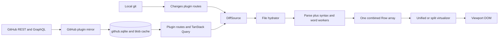

# Source and findings: what transfers to Acorn

Status: research complete, 2026-09-26. Implementation has not started.

Part of [docs/future/git-inspired/](./README.md). This file records the evidence behind the phases.
It separates what GitHub reported from what the Acorn tree currently does, because similar symptoms
do not automatically justify the same implementation.

## The source

GitHub tested a pull request with 2,200 files, more than one million changed lines, and more than 400
inline comments. Its fixed code rows use exact geometry and only a viewport-sized DOM. Variable
comment blocks use a separate height index, stable file/line/side anchors, content and state
fingerprints, and width buckets. Measurement pauses during active scrolling, batches DOM reads,
limits offscreen rendering, and commits no more than once per frame. Corrections retain the visible
row or block by identity.

The pipeline sends document structure before content, resolves the complete thread topology before
the document becomes interactive, and delays syntax, Markdown, and suggested-change work until it is
near the viewport. The last few diff documents remain in a bounded cache. Permanent structured
probes and a synthetic huge-pull-request fixture drive unattended cold, warm, scroll, resize, and
interaction loops on the real engine.

Source: [Rendering huge pull requests in the GitHub Copilot app](https://github.blog/engineering/user-experience/rendering-huge-pull-requests-in-the-github-copilot-app/),
published 2026-09-23.

Two upstream constraints also matter to Acorn's mirror:

- GitHub's [List pull request files](https://docs.github.com/en/rest/pulls/pulls#list-pull-requests-files)
  endpoint allows at most 100 files per page and exposes at most 3,000 files.
- GitHub's [GraphQL pagination guide](https://docs.github.com/en/graphql/guides/using-pagination-in-the-graphql-api)
  requires cursor traversal for a connection and caps `first` or `last` at 100.
- GitHub's [Compare two commits](https://docs.github.com/en/rest/commits/commits#compare-two-commits)
  response includes changed files only on its first page and caps that list at 300 files.

## Current Acorn flow

The DOM end is bounded. The work before it is not. That distinction is the central finding of this
review.

## Finding 1: the GitHub mirror can publish truncated topology as complete

`PR_FRAGMENT` in `plugins/github/src/server/routes/mirror/prMirror.ts` requests fixed prefixes:
20 labels; 50 reviews, review requests, issue comments, review threads, nested thread comments, and
check contexts; and 100 commits. It requests no `pageInfo`. `fetchFiles()` calls the REST files
endpoint once with `per_page=100`.

`mirrorPr()` and `mirrorFiles()` then replace every existing child row and advance `sync_state`.
The resulting mirror has no field that distinguishes an exhausted source from a prefix. A pull
request with 400 threads can therefore become a fresh mirror containing 50 threads, and a pull
request with 2,200 files can become a fresh mirror containing 100 files.

The create-PR compare preview has a related provider ceiling. Its route presents the compare
endpoint's `files` array directly, while GitHub documents that array as first-page-only and capped at
300. That source also needs an explicit incomplete state.

This is a correctness defect before it is a performance concern. Phase 1 traverses every available
page, stages the result, and swaps it into the mirror only when the topology outcome is known. A
failure preserves the previous mirror. A real upstream ceiling becomes an explicit `incomplete`
result with cause `upstream-cap`; it does not become a smaller complete document.

## Finding 2: patch availability and patch identity are ambiguous

`PullFile.patch` is `string | null`. In different reads, `null` means a summary that deliberately
omitted content, a binary or too-large patch GitHub did not supply, or a blob lookup that found
nothing. Those states require different client behavior.

The on-disk key is currently `patch:<sha>`, where `sha` is the head file blob. A patch is the change
between a base and a head, so the same head blob can have a different patch against another base.
The head blob SHA alone is not a valid immutable patch identity. It can return structurally valid but
wrong content after a base change or from another pull request.

Phase 1 adds an explicit patch state and a digest or equivalent key that identifies the patch
content. The head blob SHA remains the correct identity for fetching the new-side file body used by
gap expansion.

## Finding 3: the renderer eventually performs whole-document work

`createDiffHydrator()` in `packages/client-core/src/kit/diff/hydration.ts` queues every file during
`reset()` and keeps pumping until no queued path remains. It prioritizes the selected file and waits
between background batches, which improves first paint, but an open pane still works through the
entire document.

For each file, `DiffPane` waits for `buildDiffRowsAsync()`. That call parses, syntax-highlights, and
computes word diffs before the parsed file is published. Once files publish, the view repeatedly:

1. builds a `ParsedFile[]` across the complete file list,
2. flattens every parsed file and thread through `buildRenderableRows()`,
3. allocates an identity string for every unified row,
4. scans every row for the widest line,
5. and, in split mode, creates and keys every band.

The virtualizer limits mounted elements, but it receives the already materialized arrays. A
million-line diff can therefore mean roughly a million row objects, a million keys, repeated full
scans, and background enrichment for content the reader never approaches.

Phase 2 changes the unit of work from a document-sized row array to a bounded segment. The source
provides exact compact topology; only visible and near-visible segments become row objects. Plain
text publishes before token and word enrichment.

## Finding 4: Acorn's current row geometry is a strong base with one scaling edge

The shared diff already keeps code unwrapped at a fixed 20-pixel height, uses stable `getItemKey`
values, mounts overscan rather than the whole list, and measures only thread rows or code rows with
extras. `parsedPublisher.ts` also holds offscreen publications while scrolling. Those decisions
should remain.

The installed `@tanstack/virtual-core` 3.17.11 has a useful single-lane typed-array fast path. A
measured-size change still marks the earliest changed index and rebuilds the following offsets.
`resizeItem()` can also adjust scroll and notify synchronously from measurement. With dynamic rows
inside a million-entry geometry, the work after a comment resize can therefore scale with the code
below it, and observer callbacks can participate directly in the feedback loop.

Current thread identity is only `thread:<threadId>`. It does not include the content/state
fingerprint or measured width that decides whether an old height is reusable. The Timeline has a
better identity-anchoring pattern and explicitly distinguishes its own writes from reader input, but
the diff does not share that model.

Phase 3 keeps exact code geometry and moves variable content into a separately indexed block domain.
It adds fingerprints, width buckets, a read-then-write scheduler, and identity-based correction.

## Finding 5: parsed work is discarded at the pane boundary

Raw query data can stay in a node-scoped TanStack Query cache for a day, and patch-bearing queries
are intentionally excluded from IndexedDB persistence. The Node also keeps raw patch blobs. The
parsed and tokenized `parsedByPath` store belongs to one `DiffPane` mount and is disposed when the
pane leaves.

Returning to a recently complete diff can therefore redraw its shell from cached metadata while
repeating all parsing and enrichment. Keeping every visited parsed document would create a different
problem: an ordinary long session would accumulate large object graphs.

Phase 4 adds a renderer-memory cache of segments, weighted by rows and bytes and evicted by least
recent use. Code content and comment state have separate keys, so resolving a thread does not
invalidate parsed code. Nothing from this cache is persisted.

## Finding 6: timelines have bounded update work but unbounded mounted content

`Timeline` is deliberately not virtualized. Its previous transcript virtualizer cleared measurement
caches on every event and replaced DOM nodes during scrolling, which broke reading position and text
selection. The current Agent transcript instead maintains an incremental projection, stable item
keys, and per-row signals. That makes one streamed event cheap, but every visible conversation item
still has a DOM subtree.

The managed-agent documentation records snapshots capped at 2,000 events per page, a 7,000-event
session, and about 25 streamed events per second. GitHub's `PrConversation` also renders every entry,
and its `Timeline.Turn` currently has no stable key. Its thread snippet index parses the patch of
every available file before individual thread cards use a five-line excerpt.

Phase 5 first adds stable PR turn keys and browser content containment. It removes the all-file
snippet index in favor of segment-backed, near-turn snippets. If the phase 0 fixture shows that card
construction still exceeds the budget, callers render a fixed tail window with **Show earlier** and
identity-aware expansion. The failed generic variable-height virtualizer is not revived.

## Finding 7: existing telemetry sees cost, not the rendering invariants

Acorn already records `diff.parse`, `diff.rows`, file and row counts, worker queue health, renderer
frame gaps, render spans, transcript projection, and card construction. The real desktop can already
be driven through WebDriver with snapshots, scrolls, clicks, fills, screenshots, and injected reads.

Missing signals are the ones needed to prove the design:

- mounted fixed rows, dynamic blocks, and segments versus total topology,
- measurement candidates, DOM reads, commits per frame, and commit duration,
- correction magnitude and identity drift,
- source-owned blocks inserted after document readiness,
- active `ResizeObserver` counts and teardown,
- blank mounted blocks or visible uncovered ranges,
- resident segment, row, token, and estimated-byte counts,
- queue distance from the viewport and work completed for never-visited segments.

Phase 0 adds those as permanent numeric probes, plus a generated local Changes and Agent fixture that
does not need GitHub credentials. It uses the real Tauri window for engine behavior and mocked
provider tests for pagination and atomic mirror behavior.

## Priority and blast radius

| Priority | Work | Why first | Main boundary crossed |
| --- | --- | --- | --- |
| P0 | Health contract and fixture | Every later claim needs reproducible evidence | Desktop automation, renderer telemetry, testkit |
| P0 | Complete GitHub topology | Current output can be wrong while appearing fresh | GitHub provider, SQLite mirror, plugin wire types |
| P1 | Segmented diff document | Removes allocations and work proportional to total rows | New pure package, Node/plugin routes, plugin API, client-core |
| P1 | Dynamic block geometry | Removes suffix rebuilds and scroll drift under variable content | Diff layout and measurement only |
| P2 | Resident segment cache | Improves revisit latency after the bounded model exists | Per-node renderer state and lifecycle |
| P2 | Bounded timelines | Long transcripts and PR conversations are a separate surface | Shared Timeline callers and GitHub conversation data |

The broadest change is phase 2 because `DiffSource` is published through the plugin API and has three
first-party producers: pull requests, compare previews, and local Changes. It should be an atomic
contract migration with a plugin API version decision, not a long period where both full-document
and segmented paths run in production.

## Verify before building

- Re-read the GitHub article and the current GitHub REST and GraphQL pagination documentation; page
  sizes and upstream ceilings are provider contracts that can change.
- Confirm every connection and `first` value in
  `plugins/github/src/server/routes/mirror/prMirror.ts`; do not assume the list above remains complete.
- Confirm all writers of `pr_files`, `review_threads`, and `sync_state` before changing atomicity.
- Confirm `packages/node-core/src/server/blobs.ts` still keys patches only by file SHA and find every
  reader before changing the key.
- Trace all three `DiffSource` producers from
  `plugins/github/src/client/DiffForPull.tsx` and
  `plugins/github/src/client/ComparePreview.tsx`, plus
  `plugins/changes/src/client/changesModel.tsx`, through `DiffPane` before changing the shared port.
- Inspect the installed `@tanstack/virtual-core` source again if its lockfile version changes; the
  geometry conclusion above is version-specific.
- Re-run the transcript and PR conversation tests before choosing a window size; item counts and
  content costs, rather than the prose in this file, set that value.
