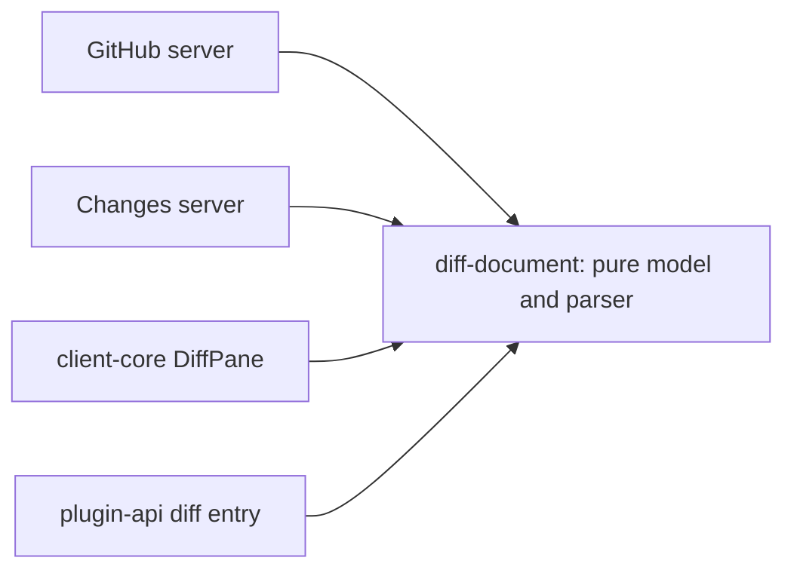

# Phase 2: a structure-first segmented diff document

Status: shipped 2026-09-26, tested in jsdom and against real Git and a mocked GitHub. The real-window run
at `scale` and `canonical` is owed.

## Goal

The shared diff viewer receives a complete compact topology, exact fixed-row geometry, and bounded
content segments. It creates row objects only for visible and near-visible segments. Plain code
appears as soon as a segment arrives; syntax tokens and word diffs enrich it later. Keeping a pane
open does not cause the loader or highlighter to drain the whole document.

GitHub pull requests, GitHub compare previews, and local Changes all use the same source-neutral
contract. File navigation, split mode, find, annotations, gap expansion, inline threads, comments,
and editor actions remain functional.

## Why this phase

DOM virtualization currently begins after Acorn has parsed and flattened the document. The target is
to make the unit of allocation, loading, parsing, keying, enrichment, and eviction a bounded segment.
That requires a topology producer on the Node/provider side and a new published source contract; it
cannot be fixed by changing virtualizer overscan.

Phase 1 supplies complete file/thread sets, provider order, and patch content keys. Phase 0 supplies
the scaling signals used to choose segment limits and prefetch distance.

## Scope

In:

- A pure runtime-neutral diff-document package containing structural types, stable identities,
  patch parsing, segmentation, projection counts, and schemas/versioning.
- Exact topology for unified and split projections without materializing every row in the renderer.
- Segments bounded by encoded bytes and display rows.
- Node/provider production of topology and plain segment payloads for GitHub PRs, GitHub compares,
  and local Changes.
- A breaking `DiffSource` migration from whole-file patches to topology, segment, block-content, and
  document-search operations.
- A segment virtualizer/canvas and a loader that tracks visible and near-visible demand.
- Plain-first rendering and a separate near-viewport enrichment queue.
- Complete source-owned thread descriptors before ready, with thread bodies loaded near their block.
- Visible-range annotation requests, document-wide find without loading every segment into the
  renderer, segment-aware file/line navigation, collapse, split mode, and gap expansion.
- Removal of the monolithic production path from `DiffPane` after all three sources migrate.

Out:

- Dynamic-height scheduling and the final two-domain correction policy (phase 3). This phase uses
  stable estimates and measures mounted segment containers through the existing adapter.
- Cross-navigation retention of parsed segments (phase 4). This phase keeps only the active
  document's bounded working set.
- Conversation timeline windowing (phase 5).
- Replacing small, explicitly bounded uses of the pure row builders in TUI tests or compact previews
  that do not use `DiffPane`. Keep those exports unless their own evidence justifies removal.
- A second transport protocol. Start with bounded JSON topology and batch endpoints; add streaming
  only if phase 0 shows topology transfer itself is the remaining blocker.

## Package and boundary

Create one workspace package, provisionally `packages/diff-document/` with package name
`@acorn/diff-document`. Confirm the final name against repository conventions before building. Its
dependency direction is:



The package imports no Solid, DOM, TanStack Query, database, Hono, filesystem, worker, or provider
module. It may depend on the patch parser. It owns:

- wire-safe topology and segment types,
- plain structural row types,
- stable file, segment, row-anchor, and block-anchor identities,
- parsing a hunks-only patch into plain rows,
- segmentation and fixed-height summaries for unified and split projections,
- deterministic content/version keys,
- validation at the route boundary.

Client-core continues to own Solid state, row components, interaction, virtual range selection,
scroll restoration, and enrichment. Provider plugins continue to own fetching, storage, mutation,
permissions, and translating provider threads into the source-neutral block descriptor. No GitHub
type enters `@acorn/diff-document` or client-core.

Do not put the parser back into `packages/protocol`. Protocol owns Acorn transport contracts. This
model is consumed directly by server and renderer code and has parsing behavior of its own, which is
why it deserves a small package.

## Document contract

Names below are the intended vocabulary. Adjust spelling to repository conventions without changing
the ownership or invariants.

```ts
type DiffDocumentTopology = {
  schemaVersion: number
  revision: string
  completeness: { kind: 'complete' } | { kind: 'incomplete'; cause: string }
  files: DiffDocumentFile[]
  segments: DiffSegmentDescriptor[]
  blocks: DiffBlockDescriptor[]
  totals: {
    files: number
    unifiedRows: number
    splitBands: number
    fixedHeightUnified: number
    fixedHeightSplit: number
    maxColumns: number
  }
}

type DiffSegmentDescriptor = {
  id: string
  contentKey: string
  fileId: string
  ordinal: number
  unifiedRows: number
  splitBands: number
  fixedHeightUnified: number
  fixedHeightSplit: number
  maxColumns: number
  firstAnchor: DiffRowAnchor | null
  lastAnchor: DiffRowAnchor | null
}

type DiffSegmentPayload = {
  schemaVersion: number
  id: string
  contentKey: string
  rows: PlainDiffRow[]
}
```

Topology contains metadata and counts, not source lines, tokens, Markdown bodies, or a `Row` object
per line. A descriptor is small enough that 2,200 files and several thousand segments can arrive in
one bounded response. Phase 0 measures that assumption; if the response exceeds the route budget,
page topology by file while retaining one final ready boundary.

`revision` identifies the whole diff shown by the source. A segment `contentKey` identifies its exact
plain content and parser/schema version. Comment resolution or body edits change block fingerprints,
not code segment keys. A file carries both its new-side blob SHA, when one exists, and its patch
content key; they serve different operations.

Every navigable row has a structural anchor. Code anchors use stable file identity, side, and line
coordinates, with a deterministic occurrence suffix for provider data that lacks line numbers.
Hunk, gap, header, load, and no-diff rows use stable structural identities. Array indices and display
text are never persistent identity.

## Segment rules

Choose limits from phase 0, then write them as named constants with tests. The rules are fixed:

- Bound both display-row count and UTF-8/serialized bytes. A generated one-line file must not defeat
  the byte budget.
- Prefer boundaries between hunks. Split an oversized hunk deterministically when necessary.
- Keep a single row whole. A row over the byte limit becomes one explicitly oversize segment and is
  counted separately by the health probe.
- Include enough descriptor information to know exact fixed height, unified row count, split band
  count, and maximum columns without reading the payload.
- Segment IDs remain stable while preceding files or segments are inserted. Derive them from file
  identity, patch content key, parser version, and local ordinal, not global position.
- The same plain payload supports both projections. Bounded client work may turn its rows into split
  bands; topology already carries the split count needed for exact scrolling before payload load.
- Malformed patches use a deterministic raw-line fallback and still produce bounded segments. A
  display problem does not make the rest of the document inaccessible.

The current `buildRowSkeleton()` already separates structural parsing from token application. Move
and generalize that pure work. `buildDiffRowsAsync()` becomes an enrichment convenience for bounded
callers, not the production document-loading primitive.

## Source port

Replace the whole-file members of `DiffSource` with document operations. The port should have this
shape conceptually:

```ts
type DiffSource = {
  scope: DiffViewScope
  topology: () => DiffDocumentTopology | undefined
  loading: () => boolean
  signature: () => string
  contentSignature?: () => string
  selectedAnchor: () => DiffAnchor | null

  cachedSegment: (id: string, contentKey: string) => DiffSegmentPayload | null
  loadSegments: (requests: DiffSegmentRequest[], signal?: AbortSignal) => Promise<DiffSegmentPayload[]>
  loadBlockContent?: (ids: string[], signal?: AbortSignal) => Promise<DiffBlockContent[]>
  search: (request: DiffSearchRequest, signal?: AbortSignal) => Promise<DiffSearchPage>
  expandGap?: (anchor: DiffGapAnchor, signal?: AbortSignal) => Promise<DiffOverlaySegment>

  // existing capabilities, retargeted to stable anchors
  canComment: () => boolean
  addComment?: ...
  reply?: ...
  resolveThread?: ...
  invalidate: () => void
  lineAction?: ...
  openLine?: ...
  find: { ... }
}
```

Do not keep `files`, `cachedFile`, `fetchPatches`, `threads`, and the new document members as two
production paths. Migrate GitHub PR, GitHub compare, Changes, tests, and fixtures atomically. If the
type change is incompatible for third-party compiled plugins, bump `PLUGIN_API_MAJOR`, update the
surface snapshot, and state the migration in plugin authoring docs.

The source may satisfy `cachedSegment` from a query cache or the phase 4 resident cache. A null means
not resident, never “this segment has no diff”; no-diff is topology and payload data.

## Provider implementations

### GitHub pull requests

During file mirroring, parse each available patch once on the Node side. Store bounded plain segment
payloads under content-addressed keys and retain only descriptors plus file metadata in SQLite. Blob
writes precede the atomic topology swap, as in phase 1. An unavailable patch produces a no-diff
descriptor and no segment body.

Expose bounded routes for:

- document topology,
- a batch of segment IDs/content keys,
- a batch of inline-thread body IDs,
- document search pages,
- gap/new-side content if the existing blob route is not enough.

The topology route joins the complete file resource with complete thread descriptors from phase 1.
It reports ready only after both match the pull's current head/revision. A refresh must not combine
new files with old thread anchors. If the two mirrors cannot be committed together, the topology
assembler checks their revision/head keys and returns a loading/stale outcome until they agree.

Thread descriptors include stable thread ID, file/side/line anchor, resolved state, comment IDs,
content fingerprint, and a body availability state. Bodies remain in the GitHub mirror and are
returned only for requested blocks. The initial diff no longer needs every body to construct code
geometry.

### GitHub compare preview

`ComparePreview` is a third `DiffSource` producer and must migrate in the same change. The GitHub
compare REST endpoint exposes at most 300 changed files, only on the first response page. Phase 1
must make that cap explicit. Have the server translate the bounded compare result into the same
topology and segment routes or into a response-local document store keyed by base/head revision.
Do not rebuild a monolithic document in the renderer merely because this source often happens to be
small.

### Local Changes

Add a Changes-owned document route over the existing validated worktree and `LocalStatus` content
keys. Generate patches in bounded path batches rather than spawning one process per file when a
whole topology is requested. Staged and unstaged stacks remain separate documents, preserving the
current rule that the same path cannot appear twice in one row identity.

The server parses and segments the current patches, then returns topology plus bounded segment
payloads keyed by the per-file content key and document signature. It may keep these in a short
process-local cache tied to the coalesced status revision; it does not need durable blobs. A segment
request whose content key no longer matches returns a revision conflict, causing the source to
refresh topology rather than drawing rows from two worktree states.

Untracked files, symlink refusal, staged new-side reads, deleted files, and operation invalidation
retain their existing security and correctness rules.

Review notes become source-owned block descriptors up front. `lineExtra`/`hasLineExtra` callbacks
that discover notes only after a row is built are removed from the production source contract.

## Renderer model

Replace `createDiffHydrator` in `DiffPane` with three independent layers:

1. **Topology model.** Holds descriptors, file lookup, stable anchors, fixed-height prefix data, and
   collapsed/expanded local overlays. It does not hold a row per line.
2. **Segment loader.** Accepts the current visible range and a bounded prefetch range. It loads
   visible segments first, coalesces batch requests, cancels an obsolete revision, and removes queued
   work once it falls outside the near range. It never walks an initial queue of every segment.
3. **Enrichment queue.** Sends plain rows to syntax and word-diff workers only for mounted and nearby
   segments. Plain rows publish immediately. Enrichment results are generation-checked and may
   replace tokens without changing row identity or fixed geometry.

Virtualize segment containers rather than a document-sized row array. A mounted segment renders its
bounded rows with the existing `DiffRows` components. A visible segment whose payload is in flight
renders an exact-height skeleton owned by that descriptor, so no uncovered gap appears and the
scrollbar does not collapse. Overscan is expressed in pixels or a small number of segments and is
chosen from phase 0.

This removes these whole-document memos from the hot path:

- combined `ParsedFile[]`,
- `buildRenderableRows()` across every file,
- `rowIdentityKeys()` across every row,
- `maxLineCols()` across every row,
- `toBands()` and split keys across the whole document.

Keep equivalent helpers for one bounded segment. The canvas width comes from topology maxima. Sticky
file headers and file navigation come from descriptor ranges. Selected-file navigation can resolve
an exact offset before that file's payload loads.

## Threads and dynamic blocks

The topology contains every source-owned inline thread before `ready`. A descriptor is anchored to a
file, side, and line identity, not inserted into a global row array. Near-viewport block content is
loaded in batches and renders a skeleton until present. A body arriving changes only the block's
dynamic height; it does not change fixed row counts or segment identity.

User-created composers and extension annotations are allowed late dynamic blocks. Record their
reason separately for the phase 0 invariant. Annotations are requested only for code anchors in the
visible and near segment ranges. The current effect that flattens every code row into
`requestAnnotations()` must disappear.

Phase 2 may let the segment virtualizer measure a container whose dynamic estimates changed. Phase 3
moves those heights and corrections into their final separate index.

## Find, navigation, collapse, and gaps

**Find.** The current controller scans materialized rows. Add a source operation that searches the
whole document without loading it into the renderer. GitHub searches stored plain segments; Changes
searches the revision-bound generated document. Results are bounded pages of stable row anchors and
match ranges. The client loads the target segment on navigation. Queries and matched text never enter
telemetry.

**Navigation.** File, line, thread, annotation, and search targets resolve through stable anchors to a
descriptor and local row. `scrollToIndex` over a flat array is no longer the public operation.

**Collapse.** Collapsing a file removes its segment fixed heights from the local topology view while
retaining the descriptors and cache entries. The change captures and restores an identity anchor.

**Gap expansion.** Expanding a gap returns a revision-bound overlay segment with exact fixed rows and
height. It is keyed by gap identity and new-side content key and is inserted into the local topology,
not spliced through a copy of every document row. A stale result is discarded. Phase 3 owns the final
correction policy when the overlay changes geometry.

## Migration slices

Land the phase in reviewable slices while keeping the final production switch atomic:

1. Add the pure package, fixtures, parsers, segment schemas, and projection-count tests.
2. Add GitHub pull-request, GitHub compare, and Changes topology/segment/search routes behind tests,
   without switching the client.
3. Add the segment loader, bounded enrichment, and segment canvas under a temporary test-only entry.
4. Migrate all three `DiffSource` producers and the large fixture; bump the plugin API major if
   required.
5. Switch `DiffPane`, remove its monolithic hydration path, and delete any temporary adapter.
6. Update TUI/compare/toolkit callers only where the published type change requires it; retain useful
   bounded pure builders.

No merged state should make the production `DiffPane` build both document forms. A short-lived branch
adapter is fine; a shipped dual path would double memory and let behavior drift.

## Code touched

- New `packages/diff-document/` package and workspace/build configuration.
- `packages/client-core/src/features/diff/`: source contract, topology model, segment loader, canvas,
  find, sticky file, restoration, and view state.
- `packages/client-core/src/kit/diff/`: bounded segment row projection and existing row components;
  removal or narrowing of whole-document helpers from the production path.
- `packages/client-core/src/infra/highlight/`: generation-aware bounded segment enrichment.
- `packages/plugin-api/src/ui/diff.ts`, surface snapshot, and protocol API version when required.
- GitHub mirror/schema/routes/shared API/client sources, including `ComparePreview.tsx`.
- Changes local-git routes/client/model source.
- Diff fixtures, desktop health flow, TUI callers, and focused tests.

## Tests

### Pure document package

- Segment boundaries are deterministic and honour both row and byte limits.
- Unified row counts, split band counts, fixed heights, maxima, and anchors equal the current bounded
  row builders across generated patches and malformed fallback input.
- Concatenating segment payloads produces the same visible plain rows as the current parser for a
  representative corpus.
- Inserting a preceding file does not change another file's segment or row identities.
- Same head blob with different patch content yields different segment keys.
- An oversize single row is preserved and explicitly counted.

### Provider contracts

- GitHub topology and segments all share one head/revision; a mismatch does not report ready.
- Missing, stale, duplicate, or over-limit segment requests fail with bounded errors.
- Changes rejects a segment after its content key moves and does not mix staged and unstaged states.
- Compare preview exposes its 300-file upstream cap.
- Search returns anchors across unloaded segments and pages results without recording query text.

### Renderer

- First visible plain rows appear before deferred tokenizer promises resolve.
- Leaving a pane open without scrolling does not load or enrich segments beyond the prefetch range.
- Jumping from the first to last file cancels/deprioritizes the old range and mounts valid content at
  the target without loading intervening segments.
- Unified and split mode, find, file collapse, selected path, gap expansion, annotations, comments,
  and editor reveal retain behavior.
- A topology revision aborts old requests and cannot publish stale rows.
- `scale` and `canonical` fixtures keep mounted rows, active payloads, queue distance, and per-frame
  work in the phase 0 additive band even though total rows increase tenfold.
- No combined million-entry `Row[]`, row-key array, or split-band array is retained in the canonical
  health snapshot or heap profile.

Run the TUI long-diff suite because it shares pure row types, even though its painter remains its own.

## Docs owed

Per [docs-migration.md](./docs-migration.md): `docs/architecture-overview.md`,
`docs/diff-rendering.md`, `docs/github-integration.md`, `docs/api-reference.md`, `docs/plugins.md`,
`docs/plugin-authoring.md`, and `docs/testing.md`.

## Done when

- The canonical fixture becomes interactive without allocating document-sized row, key, band, or
  token arrays in the renderer.
- Only visible and near segments load and enrich; an untouched tail performs no work.
- The scrollbar, file jumps, split projection, find, and source-owned thread positions are correct
  from topology before their content loads.
- GitHub PR, GitHub compare, and Changes use the same new port with no production compatibility
  adapter.
- Plain text remains usable if both enrichment workers are slow or unavailable.
- `pnpm lint`, pure package tests, client-core diff tests, GitHub and Changes suites, TUI long-diff
  tests, desktop canonical flow, and `pnpm test` pass.

## Verify before building

- Find every current `DiffSource` object, including `plugins/github/src/client/DiffForPull.tsx`,
  `plugins/github/src/client/ComparePreview.tsx`, the Changes model, and test fixtures.
- Find every import of `buildDiffRows`, `buildDiffRowsAsync`, `buildRenderableRows`, `toBands`,
  `rowIdentityKeys`, and `maxLineCols` before moving pure parsing.
- Confirm package dependency rules in `tools/arch/boundaries.test.ts` and workspace build order before
  adding `@acorn/diff-document`.
- Confirm route body and response limits before choosing segment request and payload caps.
- Recheck the GitHub compare endpoint's current 300-file behavior in official documentation.
- Trace annotation requests, find results, sticky headers, scroll restoration, gap expansion, and
  selected-file navigation through current tests; they are easy to lose in a renderer-only rewrite.
- Check the current `PLUGIN_API_MAJOR` and surface snapshot rule. Do not infer compatibility from the
  fact that a changed member is a TypeScript type rather than a runtime export.

## What shipped differently

The owning docs describe what runs: [diff-rendering.md](../../diff-rendering.md) § The document, § The
source port, § Data flow, § Parsing and highlighting and § Row geometry;
[github-integration.md](../../github-integration.md) § Diff documents;
[api-reference.md](../../api-reference.md) § GitHub and § Changes diff document;
[architecture-overview.md](../../architecture-overview.md) § Node API and client flow; and
[telemetry.md](../../telemetry.md) § Rendered-surface health. Where this file and those disagree, they
win.

Where the pieces live, for phase 3:

- The pure package is `packages/diff-document` (`@acorn/diff-document/document`): `model.ts` (types,
  limits, `segmentContentKey`), `parse.ts`, `segment.ts` (`segmentRows`, `describeSegment`,
  `bandCount`, `documentTopology`), `search.ts`, `cache.ts`.
- **Segment and row geometry** is `packages/client-core/src/features/diff/documentView.ts`. `items()`
  is the virtual list: a `file` header, a `segment` (with `skipFirst`/`skipLast` when an edge gap is
  expanded), a `nodiff` row, or an `overlay` slice of revealed context. `estimate(item, mode)` is the
  exact fixed height from the descriptor (`(rows or bands − gaps) × 20 + gaps × 28`, 36 for a header,
  28 for no diff, 20 a row for an overlay) plus `reserved()`, the thread reservation per segment item
  (140px open, 50px resolved) found from the segment's line span by `segmentOfLine`.
- **Thread and dynamic rows today**: threads are `{ kind: 'thread' }` rows interleaved into a
  mounted segment's rows by `withThreads` in `DiffPane.tsx`, one cached row object per thread. Source
  line extras (review notes) and other plugins' marks are drawn inside the code row, under
  `.diff-line-extra`, and `hasLineExtra` decides whether a row has any. None of these has a height of
  its own anywhere: the segment container is the unit that is measured. `DiffCanvas.tsx` hands every
  mounted `.diff-item` to `scheduleElementMeasure`, TanStack observes it from then on, and a change in
  a thread, composer, note or mark reaches geometry only as that container's new height.
- **The virtualizer wiring** is two `createDiffVirtualizer` calls in `DiffPane.tsx` (`virt`,
  `splitVirt`), both over `view.items` with `itemKeys` (`f:path`, `s:path:ordinal`, `n:path`,
  `o:path:ordinal:edge:at`) and the two estimate modes, `estimates: view.reserved` so a thread arriving
  for an unmeasured segment recomputes offsets. `kit/diff/virtualization.ts` hands TanStack
  `getItemKey` through a getter for that reason, uses `overscan: 0` and a `rangeExtractor` with an
  800px runway, and keeps the phase 0 measure counters. `activeVirt()` is the one for the view mode;
  the loader's demand effect, the annotation request and the sticky header all read its virtual items.
  Scroll restoration is still the pixel restorer in `scrollRestoration.ts`.

Deviations from the plan:

1. **Plugins import `@acorn/diff-document` directly**, the way they import protocol, and
   `tools/arch/boundaries.test.ts` says so. The plan routed it through the facade. A facade
   re-export on `/node` would have put the renderer's types into the node's type graph through a
   plugin's `shared/api.ts`, which failed `tsc` in `apps/node`. `/ui/diff` still re-exports the types
   the port is written in, and `documentTopology`, which the Changes source uses.
2. **Descriptors carry counts, not pixels, and no ids.** A segment is `{ rows, bands, gaps, columns,
   lines, oversize? }`; its identity is its patch digest and ordinal (`segmentContentKey`), and a
   file's identity is its path. Heights are the renderer's, because they are CSS. Explicit ids and
   content keys per descriptor would have added about 140 bytes to each of 27,000 segments.
3. **The topology has no `completeness` and no `blocks`.** Completeness stays on the provider's
   envelope (`PullDiffResponse`, `Compare`), because only the provider's own warning reads it. Inline
   threads stay on the source's `threads`, from the PR detail, which is complete and already holds
   every body; the conversation tab loads it anyway, so a block-body route would save nothing. The
   viewer reserves each thread's space from the segment line spans, so thread positions are right
   before their segments load. There is no `loadBlockContent`, and the files and detail mirrors are
   not matched on a head revision: they refresh separately, as before, and a thread whose line is in
   no segment is not drawn.
4. **No `cachedSegment` and no `expandGap` on the port.** The loader owns what is resident, which is
   where phase 4's cache belongs. Gap expansion keeps `fileText`; the revealed lines are an overlay
   built in the renderer, keyed by the segment's content key, drawn as 64-row slices. `selectedPath`
   and `signature` stayed. `contentSignature` and `contentKey` went: a segment keyed by content makes
   them unnecessary.
5. **Gaps always sit at a segment's edge.** A top or middle gap opens a segment and the bottom gap
   closes one, so an overlay goes beside a segment rather than through it. That costs segments: the
   canonical fixture is 27,653 segments and a 2.49 MB topology, cut on the node in about five seconds,
   once, when the files are mirrored. The topology is not paged; the real-window run decides whether
   it needs to be.
6. **GitHub stores descriptors, not segments.** Each patch's descriptors are a small blob,
   `diffdoc:v1:<digest>`, written beside the patch body before the swap, and a topology read parses
   nothing. Segment rows are cut from the content-addressed patch body on request, with a 64 MB
   parse cache in the plugin process. That avoids a second copy of every patch on disk and a SQLite
   migration; a mirror written before this change catches up on its first diff read.
7. **The segment and search routes are per repository**, `POST /repos/:owner/:repo/diff/segments`
   and `…/diff/search`, shared by pull requests and compare previews, because both address a segment
   by its digest. Access is the repository's, resolved as the blob route resolves it, and a digest has
   to have the shape this plugin writes before it becomes part of a blob key. Neither route checks
   that a digest belongs to a particular pull. The search body carries the document's files, because
   a compare preview has no mirror to look them up in.
8. **The compare route stores its patches** under their digests and answers a document; its query key
   became `'v3'`.
9. **Changes reads are POSTs** with bodies (`local/document`, `/segments`, `/search`). The node keeps
   a status-key cache, so a poll that moved nothing diffs nothing, and a per-file record of the digest
   the last document gave it; any other digest is a `409 revision_conflict`, even when its rows are
   still cached. Batches are 200 paths per `git diff --no-renames`, byte-identical per file to a
   single-file diff so the digests agree. Untracked files still take a `--no-index` call each. The
   per-file `local/diff` route and bridge method were removed with the whole-file port.
10. **Removed with the monolithic path**: `kit/diff/hydration.ts`, `features/diff/parsedPublisher.ts`,
    GitHub's `POST …/files/patches`, and the client's `filesOptions`, `filePatchOptions`,
    `fetchFilePatches`, `filesKey` and `filePatchKey`. A force refresh now reads the diff document.
    The bounded row builders (`buildDiffRows`, `buildDiffRowsAsync`, `buildRenderableRows`,
    `toBands`, `rowIdentityKeys`, `maxLineCols`) stay, on top of the package's parser; production
    uses only `toBands` and `enrichDiffRows`, per segment.
11. **Health.** `topology.segments` and `work.unvisitedSegments` are new fields. The diff is `ready`
    when its topology is in and its source is not loading, which for a pull request includes the
    detail's threads. `heldPublications` is always zero, because nothing is held back during a
    scroll. Queue distance is in segments.
12. **Every mounted item is measured**, not only threads, because the segment container is the unit.
    A segment without dynamic content measures its estimate and commits nothing.
13. **Collapse keeps the reading place only in the one case that loses it**: collapsing a file from
    the sticky header scrolls back to that header. A general identity anchor is phase 3's.
14. **The terminal host's `DiffPane` reads the same document**, and loads only the segments its
    window reaches. It used to parse whole patches, and for the Changes pane it drew no rows at all,
    because that source never put a patch on its files.
15. **Telemetry**: `diff.segments.load`, `diff.segments.enrich`, `diff.segments.requested`,
    `diff.files` and `diff.document.segments` replace `diff.parse`, `diff.rows` and
    `diff.hydrator.*`.
16. **Plugin API major 2** (docs/plugins/package-shape.md § The plugin API). The type change to
    `DiffSource` was a break by itself, and `createDiffHydrator` came off `/ui/diff`.
17. A small fix on the way: a split band for an unchanged line drew that line's notes twice.

Not built or not verified:

- The real-window run. Only jsdom saw the segment canvas, with a modelled layout
  (`features/diff/layout.helper.ts`), and only at the `small` and `scale` profiles; `canonical` was
  measured as a topology, not rendered. There is no heap profile. Smoke checklist item 82 in
  [testing.md](../../testing.md) is owed.
- GitHub's 300-file compare ceiling was not re-checked against GitHub's documentation in this phase;
  phase 1's behaviour stands.
- The Changes source's refetch on a `409` has no client test; the node's refusal does.

