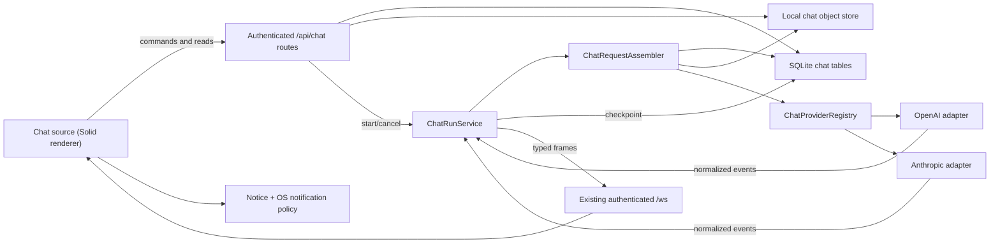

# Architecture

## 1. Where this belongs in Acorn

Acorn is already a statically composed, in-tree plugin platform:

- `core/` owns registries, the shell, persistence, auth, SQLite, HTTP, WebSocket transport, and shared
  UI primitives;
- `plugins/<name>/` owns feature behavior split into `client`, `server`, `main`, and `shared` runtime
  parts;
- `app/` is the only layer that chooses and activates built-in plugins.

The existing source registry is the right top-level UI seam. `TabRail` renders source contributions at
the top of the left rail, and `App` renders the selected source's component. Chat is not a task pane:
its parent is `workspaceId`, it survives with no task selected, and one workspace's threads must never
appear in another workspace.

The feature therefore lives under:

```text
apps/desktop/src/plugins/chat/
  client/    Solid source view, queries, scoped state, Markdown/code components
  server/    repositories, routes, provider adapters, prompt assembly, run service
  main/      chat object store and lifecycle wiring where filesystem ownership is required
  shared/    serializable domain/API/WebSocket contracts and strict schemas
```

Activation stays in `app/`. Core gains only genuinely reusable seams: source visibility independent of
an integration connection, chat frame variants on the shared socket, generalized notice targets, and
shared code-token rendering extracted from the current GitHub-only Shiki module.

## 2. Current seams and required pressure changes

| Existing seam | Current behavior | Chat change |
| --- | --- | --- |
| `core/client/registries/sources.ts` | Source requires `providerId`, promotion, and integration gating | Make `when`/visibility explicit and promotion optional so an always-visible non-promotion source is valid |
| `core/client/tabs/sources.ts` | GitHub always; registry sources only when an integration capability is connected | Evaluate each contribution's `when(context)`; chat returns true for every real workspace |
| `core/client/App.tsx` | Renders selected source component with no props | Pass a typed `SourceViewContext` containing the active workspace and navigation services |
| `core/server/routeRegistry.ts` | Authenticated plugin routers under `/api` | Mount `/api/chat`; retain core auth/CSRF ordering |
| `core/shared/ws.ts` / `wsClient.ts` | Terminal/workflow frames | Add typed chat lifecycle/delta frames and connection-state callback |
| `core/main/wsHub.ts` | Ordered authenticated broadcast socket | Broadcast chat frames; no second socket or SSE transport |
| notice registry/store | Notice target is always `taskId`; toast suppression checks only document focus | Generalize to discriminated navigation target and surface-aware attention test |
| `core/server/db/schema.ts` | One Drizzle schema/migration journal | Add chat plugin tables and indexes; keep app-level cascade conventions |
| `core/server/blobs.ts` | Unbounded immutable GitHub cache | Do not reuse; add owned chat object store with ref cleanup and limits |
| `plugins/github/client/shiki.ts` | Fine-grained dual-theme Shiki tokens inside GitHub plugin | Extract generic language/token loader to core UI; GitHub and chat both consume it |

### Source contract target

The source contribution should become conceptually:

```ts
type SourceViewContext = {
  workspace: Workspace | null
  workspaceId: string | null
  navigate: (target: AppNavigationTarget) => void
}

type SourceContribution<Item = never> = {
  id: string
  glyph: string
  label: string
  when?: (context: SourceViewContext) => boolean
  component: Component<SourceViewContext>
  originGlyph?: string
  defaultPane?: string
  promotion?: SourcePromotion<Item>
}
```

Existing integration sources adapt by putting their connection/capability test in `when`. Existing
promotion behavior remains unchanged. Chat registers `id: 'chat'`, has no promotion, and is visible
when `workspaceId !== null`.

Do not special-case `chat` in `TabRail` or `App`. If implementation cannot add chat without a string
comparison in core rendering, the contribution seam is incomplete.

## 3. Target topology



There is still one local server, one database, one WebSocket, one application lifecycle, and one
renderer origin. Chat adds no daemon, sidecar, cloud relay, local public port, or renderer-to-provider
connection.

## 4. Ownership by runtime

### Renderer/client

Owns presentation only:

- selected thread, composer text, pending attachment UI, local scroll/follow state;
- TanStack Query projections of thread/message/provider data;
- optimistic merge of ordered WebSocket deltas into the active query result;
- Markdown/code/image/file presentation;
- determining whether the exact completed thread currently has user attention;
- pushing an in-app notice and OS toast when it does not.

It never owns API keys, provider clients, authoritative messages, object-store paths, request
assembly, input budgeting, or provider error mapping.

### Server

Owns durable behavior:

- workspace/thread/message authorization and input validation;
- provider connection lifecycle and encrypted credential lookup;
- repositories over chat tables;
- prompt assembly and attachment resolution;
- the provider registry and adapters;
- run creation, normalized stream consumption, cancellation, checkpoints, finalization, and restart
  interruption recovery;
- emitting serializable chat events after successful state transitions.

Routes are thin adapters over services. Provider adapters do not receive Hono contexts and services do
not construct HTTP responses.

### Main/filesystem

Owns the chat object store root under Acorn's data root and its atomic write/read/delete primitives.
The service accepts opaque object keys, not arbitrary paths. The server repository is responsible for
proving a requested attachment belongs to the target workspace before asking the object store to read
it.

### Shared

Contains strict Zod schemas and TypeScript types for:

- domain projections and HTTP payloads;
- provider-neutral model and stream contracts;
- WebSocket frames;
- navigation/notice targets used by core.

Shared code is serializable and imports no SDK, Hono, Solid, Electron, database, or filesystem module.

## 5. Turn data flow

1. The composer has a non-empty trimmed text value or at least one ready attachment.
2. The client creates a UUID `clientTurnId` and posts the text, attachment ids, connection id, and
   model id to `POST /api/chat/threads/:threadId/turns`.
3. In one SQLite transaction, the server validates workspace lineage, validates attachment ownership
   and readiness, allocates message ordinals, inserts the user message/parts, inserts an assistant
   placeholder, and inserts a queued run unique on `(threadId, clientTurnId)`.
4. The endpoint returns `202` with the user message, assistant message, and run. Replaying the same
   `clientTurnId` returns those same records and never starts a duplicate generation.
5. `ChatRunService` asynchronously builds a canonical request manifest from local history, explicit
   attachments, and an empty `contextItems` array.
6. The selected adapter maps the canonical request to its provider SDK and yields normalized stream
   events.
7. The run service coalesces text deltas for UI delivery, assigns monotonic `seq`, broadcasts typed
   frames, and checkpoints aggregate parts to SQLite at a bounded cadence.
8. Completion finalizes assistant parts, usage, provider request id, message/run statuses, and thread
   timestamps in a transaction, then emits `chat:completed`.
9. The client merges the event or refetches if sequence continuity was lost. If the exact thread does
   not have attention, it pushes a source-targeted notice and OS notification.
10. A provider/network error finalizes the partial assistant message as failed (partial text remains),
    records a stable error code, and emits `chat:failed`. Cancellation produces `cancelled`, not
    `failed`.

## 6. Why not use provider-hosted conversation state?

OpenAI can chain responses and providers may offer their own conversation/thread resources. They are
not the Acorn authority because:

- Anthropic and future providers do not share the same state contract;
- model/provider switching inside an Acorn thread would become lossy or impossible;
- workspace deletion/export cannot be implemented from local data alone;
- provider retention and file lifecycle become product correctness dependencies;
- an API-key rotation could strand the only copy of a conversation;
- future Acorn context must be reproducible from an explicit prompt manifest.

Adapters may retain provider request ids for diagnostics and optional optimization. They may not use a
remote id as the only route to the next turn.

## 7. Why not use the integration-provider registry?

The shipped integration contract models external accounts that expose browsable/linkable/mirrored
resources, external ids, task promotion, provider caches, and context formatting. A model provider is
a generation runtime. Forcing OpenAI and Anthropic into that descriptor would require meaningless
external-id, cached-item, resource, memory, and promotion stubs.

Chat instead owns a `ChatProviderRegistry` because there are already two implementations and more are
explicitly expected. It may reuse core secret encryption, credential-field UI primitives, error
envelopes, request budget helpers, and registry mechanics; it must not pretend the domain contracts are
identical.

## 8. State tiers and scopes

| State | Tier | Scope | Authority |
| --- | --- | --- | --- |
| Provider connections and encrypted credentials | T2 | workspace | SQLite |
| Threads, messages, parts, runs, attachment metadata | T2 | workspace lineage | SQLite |
| Attachment bytes | T2 | workspace lineage via metadata | chat object store |
| Thread list/message query results | projection of T2 | workspace/thread | TanStack Query only |
| Selected thread, list scroll, message selection | T4 | workspace | plugin scoped client state |
| Draft text and draft attachment ids | T3 | workspace + thread | versioned bounded prefs slice |
| Last model/connection selection | T3 | workspace/thread | versioned prefs slice; thread columns after first send |
| Live AbortControllers, stream accumulators | T5 | run | `ChatRunService` |

No durable chat data is stored in IndexedDB query persistence as a second authority. Query persistence
may cache it, but SQLite wins and invalidation/refetch resolves disagreement.

## 9. Lifecycle and recovery

- At activation, register descriptors only; do no provider network work.
- After migrations and object-store construction, create one `ChatRunService` and register its dispose
  with the app lifecycle.
- At boot, mark any `queued` or `streaming` run left from the prior process as `interrupted`, preserve
  partial assistant content, and emit no stale completion notification.
- On quit, abort active provider requests, flush one final checkpoint, and mark runs `interrupted`.
- On workspace deletion, cancel workspace runs first, then delete rows and attachment references, then
  garbage-collect unreferenced objects. Never delete bytes before metadata commit.
- Disabling the chat plugin leaves all rows/objects inert and does not erase them. Re-enabling restores
  source history.

## 10. Extensibility invariants

- Adding a provider changes only `plugins/chat/server/providers/<id>.ts` and app-level provider
  activation/tests; it changes no database, UI message component, or WebSocket union.
- Adding future context changes only a context contribution plus assembler tests; it changes no
  provider adapter or stored user/assistant message.
- Adding a new visible message part adds a renderer for a canonical part kind; unknown parts remain
  stored and render as a safe fallback card.
- A source can be disabled while persisted `last_source: 'chat'` remains inert, matching Acorn's
  unknown-contribution policy.
- Provider-specific metadata is namespaced and optional. Generic behavior never branches on an
  OpenAI/Anthropic response type outside its adapter.
