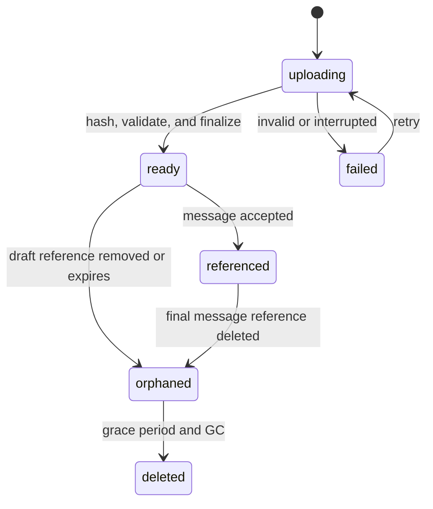
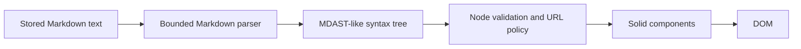

# Attachments and safe message rendering

## Scope for the first release

The portable attachment subset is deliberately smaller than the union of provider capabilities:

- images: JPEG, PNG, GIF, and WebP;
- documents: PDF;
- UTF-8 text and common source-code files.

The product may show that a provider supports additional formats, but the composer accepts only formats that Acorn can validate, store, render, and send consistently. Provider-specific formats can be added behind capability flags later.

Recommended local limits:

| Limit | Value | Reason |
| --- | ---: | --- |
| Attachments per turn | 8 | Keeps requests and composer state understandable |
| Bytes per attachment | 10 MiB | Bounds memory, disk, and provider request expansion |
| Bytes per turn | 25 MiB | Prevents several valid files forming an unsafe request |
| Decoded text bytes | 1 MiB | Avoids accidental prompt and renderer exhaustion |
| Filename length | 255 Unicode scalar values | Filesystem and UI safety |

These are Acorn limits, not promises about upstream limits. A provider adapter may impose a lower model-specific limit and must return a structured validation error before starting a run.

## Upload lifecycle



1. The renderer creates a client upload ID and begins a streamed upload.
2. The server applies count/content-length limits before reading and a hard byte counter while streaming.
3. Bytes are written to a temporary workspace-owned file while SHA-256 is calculated.
4. The server detects the actual type, validates it against the declared type and filename, and extracts only bounded metadata.
5. The temporary file is atomically moved into a content-addressed object path.
6. A SQLite metadata row is inserted only after the object is finalized; row existence plus a live
   object is the durable `ready` condition. The API returns an opaque attachment ID.
7. Sending a turn atomically creates message-part references to ready attachments owned by the same workspace.

Interrupted uploads never become ready and do not leave attachment rows. Temporary files are deleted
on failure and swept after process crashes. `uploading` and `failed` are transient client/upload-session
states, not values in `chat_attachments`.

The upload endpoint may use multipart form data, but the parser must stream and enforce limits rather than buffering the complete request. The implementation phase should select a Web `Request`-compatible streaming parser and characterize its behavior in Electron/Hono before depending on it.

## Object storage

Chat attachments must not reuse the current GitHub blob cache. That cache is an immutable performance cache without the ownership, quota, deletion, or reference semantics required for user data.

Use a dedicated root beneath the app’s workspace data area:

```text
chat-objects/
└── sha256/
    └── ab/
        └── cd/
            └── abcdef...        # bytes only; no user filename
```

SQLite owns logical attachment metadata and references. The object store owns bytes keyed by content hash. The original filename is metadata only and must never be interpolated into a path.

Deduplication is permitted within a workspace storage boundary. Do not expose hashes as public IDs or use a hash to bypass authorization. Every download resolves the opaque attachment ID, verifies its workspace relationship, and then locates the object.

### Required object-store interface

```ts
type AttachmentObject = {
  sha256: string;
  byteSize: number;
  storageKey: string;
};

interface ChatAttachmentStore {
  ingest(input: ReadableStream<Uint8Array>, limits: UploadLimits): Promise<AttachmentObject>;
  open(storageKey: string): Promise<ReadableStream<Uint8Array>>;
  delete(storageKey: string): Promise<void>;
  exists(storageKey: string): Promise<boolean>;
}
```

The database transaction cannot atomically commit the filesystem. Use a small compensating protocol:

- write and finalize bytes first;
- insert/update metadata second;
- delete newly finalized bytes if the metadata operation fails and no other metadata row references the object;
- retain a periodic reconciler for crash windows in either direction.

## Validation and type detection

Do not trust extension, browser MIME, or provider acceptance.

- Detect JPEG, PNG, GIF, WebP, and PDF by bounded magic-byte inspection.
- Validate image dimensions without fully decoding large images; reject decompression bombs and dimensions above a documented pixel cap.
- Validate text as UTF-8, reject NUL-heavy/binary content, and cap decoded bytes.
- Sanitize filenames for display by removing control and bidi-control characters while retaining the original safe display value in metadata.
- Never execute archive extraction, macro processing, document conversion, or active content in the first release.
- PDF and image metadata extraction must be time and memory bounded.

If declared and detected types disagree, reject the upload with a safe explanation. Do not silently reinterpret an executable/binary file as text.

## Provider delivery

The canonical request assembler reads authorized attachment metadata and gives adapters a bounded attachment input:

```ts
type ProviderAttachmentInput = {
  attachmentId: string;
  filename: string;
  mediaType: string;
  byteSize: number;
  open: () => Promise<ReadableStream<Uint8Array>>;
};
```

For version one:

- OpenAI receives images as image input and PDFs/text as file input using request-local data;
- Anthropic receives image/document/text content blocks supported by the chosen Messages API model;
- Acorn does not upload files into provider-managed persistent file stores;
- adapters may encode a bounded file as base64 only at the provider boundary and must account for encoded-size expansion;
- no provider file ID is conversation authority or required to replay local history.

This avoids hidden remote file lifecycle and keeps deletion semantics comprehensible. A future remote-file optimization must record provider object IDs, retention behavior, and deletion outcomes separately.

Before a send, the selected model’s capability set is checked against every attachment. Changing to an incompatible model blocks send and identifies each incompatible item.

## Attachment presentation

### Images

Images render from authenticated local attachment URLs, not data URLs embedded in message JSON. The server returns the validated content type, `X-Content-Type-Options: nosniff`, a restrictive content security policy where applicable, and private/no-store cache policy unless a safe local caching policy is established.

Use constrained thumbnails with reserved dimensions to prevent layout shifts. Opening a preview uses a controlled Acorn viewer. SVG is not accepted in the first release because it can contain active content and external references.

### PDF and text/code files

PDFs render as attachment cards with filename, size, and open/save actions. Do not embed an unrestricted PDF scripting environment in the chat DOM. A later PDF preview must be sandboxed and separately threat-modeled.

Text and code files render as cards by default. A bounded preview can show the first lines after server-side text validation. Full content is not silently expanded into the UI or copied as part of assistant text.

### Download behavior

Downloads use opaque authenticated routes and safe `Content-Disposition: attachment` headers. The response filename is encoded, stripped of path separators and control characters, and never used to determine server paths.

## Message parsing pipeline

Provider text is untrusted content. The renderer must not accept provider-generated HTML.



Recommended implementation:

- parse CommonMark plus GFM using `unified`, `remark-parse`, and `remark-gfm`;
- render the syntax tree directly to owned Solid components;
- do not add `remark-rehype`, `rehype-raw`, `innerHTML`, or provider HTML;
- treat Markdown HTML nodes as literal text or omit them with a visible safe placeholder;
- cap source length, nesting depth, table dimensions, and render work;
- parse finalized messages once and streaming snapshots at animation-frame-coalesced intervals.

The parser is a syntax parser, not a sanitizer. Safety comes from the controlled renderer and its allowlists.

## Inline elements and links

Supported inline elements:

- paragraphs, emphasis, strong, strike-through;
- ordered/unordered lists and task-list markers;
- blockquotes;
- inline code;
- links;
- tables with bounded cell counts;
- hard/soft breaks.

Link policy:

- allow only `https:`, `http:`, and optionally `mailto:` after URL parsing;
- reject `javascript:`, `data:`, `file:`, custom application schemes, credentials in URLs, and malformed encodings;
- open external links through Acorn’s existing safe external-navigation boundary;
- add `noopener`/`noreferrer` where a browser target is used;
- display the destination in accessible hover/focus affordances;
- do not automatically fetch link previews.

Remote Markdown images are not loaded in version one. They create tracking and network-privacy risks and bypass attachment validation. Render a link or blocked-image placeholder instead. Locally stored attachment images use typed message parts rather than Markdown URLs.

## Code blocks

Fenced code renders with:

- a normalized, display-only language label;
- syntax highlighting using the shared core Shiki token system;
- a copy button using the existing core copy affordance;
- plain-text fallback for unknown languages or highlighter failure;
- horizontal scrolling and optional soft-wrap preference;
- no execution, preview, or automatic command affordance.

The GitHub plugin currently owns Shiki styling. Extract the reusable token/theme setup into core UI without making Chat depend on GitHub. Highlighting should occur off the hottest streaming path: render the active incomplete fence as plain code, then highlight when stable or terminal.

Copying a code block copies the exact code text without fence markers or generated line numbers. Copying a message concatenates text and code parts in order.

## Streaming-safe parsing

Markdown can be syntactically incomplete during a stream. The client maintains:

- `durableText`: last server-checkpointed content;
- `liveSuffix`: ordered uncheckpointed deltas;
- `renderSnapshot`: coalesced concatenation shown to the parser;
- `lastSequence`: greatest applied stream sequence.

Do not attempt to persist parser state as domain data. On each scheduled render, parse the current bounded snapshot. If the parser identifies an incomplete fence or construct, the renderer favors faithful plain text over speculative structure. Completion triggers one final parse and highlight pass.

## Attachment cleanup and quotas

Cleanup is reference-aware:

- ready but never referenced: delete after a short grace period, such as 24 hours;
- referenced: retain while any non-deleted message part references it;
- deleted thread/message: remove logical references transactionally and enqueue object reconciliation;
- shared content hash: delete bytes only after the final authorized metadata reference is gone;
- failed/temp uploads: sweep aggressively after process-safe age checks.

Track per-workspace logical bytes and global physical bytes. Version one should define a conservative workspace quota and surface usage/errors in provider or chat settings. Quota enforcement belongs on upload admission, not only in cleanup.

## Attachment acceptance criteria

- Files are inaccessible across workspace boundaries even if byte hashes match.
- A process crash during upload does not create a ready attachment with missing bytes.
- A database failure after file finalization is eventually reconciled.
- Unsupported, oversized, spoofed, or binary-as-text files fail before a model run exists.
- Removing a pending attachment does not corrupt a deduplicated object used elsewhere.
- Provider requests can be reconstructed from local message parts without remote file IDs.
- Remote Markdown content cannot trigger image fetches, script execution, or arbitrary application navigation.
