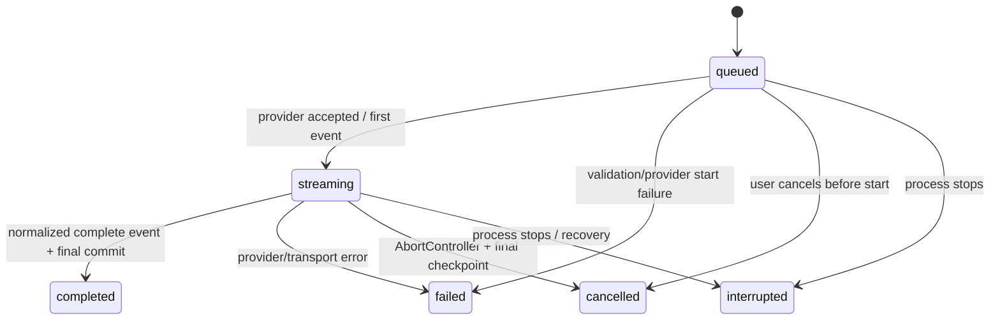

# Domain model and schema

## 1. Modeling rules

The data model must preserve five invariants:

1. Every durable entity reaches exactly one `workspaceId`, directly or through thread lineage.
2. Provider wire objects are never the stored conversation model.
3. A turn is created atomically before provider I/O begins.
4. Partial streamed output is durable enough to recover without writing SQLite once per token.
5. Attachments are first-class owned objects with explicit references and cleanup, not anonymous URLs
   embedded in message JSON.

Acorn currently uses application-level cascades rather than SQLite foreign-key declarations. Chat
follows that convention for the first implementation, adds the indexes below, and extends the cascade
tests. Do not introduce FK enforcement for chat tables alone.

## 2. Canonical TypeScript model

These names are normative; exact module split may change during implementation.

```ts
type ChatRole = 'user' | 'assistant'

type ChatMessageStatus =
  | 'complete'
  | 'streaming'
  | 'failed'
  | 'cancelled'
  | 'interrupted'

type ChatRunStatus =
  | 'queued'
  | 'streaming'
  | 'completed'
  | 'failed'
  | 'cancelled'
  | 'interrupted'

type ChatAttachmentKind = 'image' | 'pdf' | 'text'

type ChatErrorCode =
  | 'chat_provider_not_configured'
  | 'chat_provider_needs_auth'
  | 'chat_model_unavailable'
  | 'chat_attachment_not_found'
  | 'chat_attachment_unsupported'
  | 'chat_attachment_too_large'
  | 'chat_context_too_large'
  | 'chat_rate_limited'
  | 'chat_provider_unavailable'
  | 'chat_provider_rejected'
  | 'chat_stream_interrupted'
  | 'chat_run_conflict'
  | 'chat_cancelled'
  | 'chat_bad_request'

type ChatThread = {
  id: string
  workspaceId: string
  title: string
  archivedAt: number | null
  lastConnectionId: string | null
  lastProviderId: string | null
  lastModelId: string | null
  createdAt: number
  updatedAt: number
  lastMessageAt: number | null
}

type ChatMessage = {
  id: string
  threadId: string
  ordinal: number
  role: ChatRole
  status: ChatMessageStatus
  runId: string | null
  errorCode: ChatErrorCode | null
  errorDetail: string | null
  createdAt: number
  updatedAt: number
  completedAt: number | null
  parts: ChatMessagePart[]
}

type ChatMessagePart =
  | {
      id: string
      index: number
      kind: 'text'
      text: string
    }
  | {
      id: string
      index: number
      kind: 'attachment'
      attachment: ChatAttachment
    }
  | {
      id: string
      index: number
      kind: 'refusal'
      text: string
    }
  | {
      id: string
      index: number
      kind: 'citation'
      label: string
      url?: string
      providerMetadata?: Record<string, unknown>
    }
  | {
      id: string
      index: number
      kind: 'unknown'
      providerType: string
      providerMetadata?: Record<string, unknown>
    }

type ChatRun = {
  id: string
  threadId: string
  clientTurnId: string
  requestMessageId: string
  responseMessageId: string
  connectionId: string
  providerId: string
  modelId: string
  status: ChatRunStatus
  providerRequestId: string | null
  inputManifest: ChatInputManifest
  inputTokens: number | null
  outputTokens: number | null
  errorCode: ChatErrorCode | null
  errorDetail: string | null
  createdAt: number
  startedAt: number | null
  completedAt: number | null
}

type ChatAttachment = {
  id: string
  workspaceId: string
  filename: string
  mediaType: string
  kind: ChatAttachmentKind
  sizeBytes: number
  sha256: string
  createdAt: number
}
```

`providerMetadata` is parsed/serialized through a versioned codec and capped. Never cast arbitrary
stored JSON directly to a provider SDK type. Hidden provider reasoning/chain-of-thought is not a
canonical message part and must not be stored.

## 3. Tables

### 3.1 Shared model-provider connections

Chat adds no credential table. It references the app-wide, per-user `integrations` row managed by
core. Those rows already contain the opaque connection id, provider id, encrypted `authRef`,
non-secret config, capabilities, status, validation metadata, and timestamps.

Workspace/thread state may remember a connection id and model id as a preference. At use time the
server must resolve the connection under the authenticated user, require a connected
`textGeneration` capability, and tolerate a missing/disabled historical selection by asking the
user to choose again.

### 3.2 `chat_threads`

| Column | Type | Rules |
| --- | --- | --- |
| `id` | text PK | UUID |
| `workspace_id` | text not null | direct workspace scope |
| `title` | text not null | first user text, whitespace-normalized and truncated; user rename wins |
| `last_connection_id` | text nullable | selected connection for next turn; may point at disabled/deleted history and then UI asks to choose |
| `last_provider_id` | text nullable | denormalized display/history fallback |
| `last_model_id` | text nullable | opaque provider model id |
| `archived_at` | integer nullable | hidden from default list, recoverable |
| `created_at` | integer not null | milliseconds |
| `updated_at` | integer not null | metadata change |
| `last_message_at` | integer nullable | sorting; updated on committed turn creation/completion |

Indexes:

- `(workspace_id, archived_at, last_message_at desc)`;
- `(workspace_id, updated_at desc)`.

Thread title generation makes no second model request in v1. Use up to 80 user-visible characters from
the first non-empty text part; for attachment-only turns use the first filename or “New chat”.

### 3.3 `chat_messages`

| Column | Type | Rules |
| --- | --- | --- |
| `id` | text PK | UUID |
| `thread_id` | text not null | parent → `chat_threads.id` |
| `ordinal` | integer not null | monotonically allocated within thread transaction |
| `role` | text not null | `user` or `assistant` |
| `status` | text not null | canonical status union |
| `run_id` | text nullable | assistant message's generating run; null for user |
| `error_code` | text nullable | stable machine behavior |
| `error_detail` | text nullable | bounded human/provider-safe detail; no secrets/body dump |
| `created_at` | integer not null | milliseconds |
| `updated_at` | integer not null | checkpoint/finalization |
| `completed_at` | integer nullable | terminal assistant/user state |

Indexes/constraints:

- unique `(thread_id, ordinal)`;
- `(thread_id, ordinal desc)` for cursor pagination;
- `(run_id)` for event lookup.

Messages are immutable after reaching `complete` in v1 except delete/cascade. Editing/branching is
explicitly deferred; do not mutate prior user text and silently regenerate history.

### 3.4 `chat_message_parts`

| Column | Type | Rules |
| --- | --- | --- |
| `id` | text PK | UUID |
| `message_id` | text not null | parent → `chat_messages.id` |
| `part_index` | integer not null | stable order within message |
| `kind` | text not null | `text`, `attachment`, `refusal`, `citation`, `unknown` |
| `text` | text nullable | text/refusal/citation label; aggregate stream checkpoint lives here |
| `attachment_id` | text nullable | required only for `attachment` |
| `provider_type` | text nullable | original unknown/citation type for diagnostics/round-trip |
| `data_json` | text nullable | versioned, sanitized, bounded provider metadata |
| `created_at` | integer not null | milliseconds |
| `updated_at` | integer not null | text checkpoint/finalization |

Indexes/constraints:

- unique `(message_id, part_index)`;
- `(attachment_id)` for reference counting/cleanup.

Validation is structural:

- `text`/`refusal` require `text` and no `attachment_id`;
- `attachment` requires `attachment_id` and no provider payload;
- `unknown` requires `provider_type` and displays a safe fallback;
- each `data_json` is capped (recommended 32 KiB) and parsed by canonical part codec.

### 3.5 `chat_runs`

| Column | Type | Rules |
| --- | --- | --- |
| `id` | text PK | UUID |
| `thread_id` | text not null | parent |
| `client_turn_id` | text not null | renderer UUID; idempotency key |
| `request_message_id` | text not null | user message |
| `response_message_id` | text not null | assistant placeholder |
| `connection_id` | text not null | selected credential connection |
| `provider_id` | text not null | frozen registry id |
| `model_id` | text not null | frozen opaque model id |
| `status` | text not null | run state union |
| `provider_request_id` | text nullable | diagnostics only |
| `input_manifest_json` | text not null | exact local ids/hashes/context snapshot refs assembled for request |
| `input_tokens` | integer nullable | provider-reported when available |
| `output_tokens` | integer nullable | provider-reported when available |
| `error_code` | text nullable | stable code |
| `error_detail` | text nullable | bounded/redacted detail |
| `created_at` | integer not null | milliseconds |
| `started_at` | integer nullable | first provider attempt |
| `completed_at` | integer nullable | terminal transition |

Indexes/constraints:

- unique `(thread_id, client_turn_id)` — HTTP retry returns the original turn;
- unique `(response_message_id)` — one generating run per assistant placeholder;
- `(thread_id, status, created_at)`;
- `(connection_id, status)` for cancellation/health/rotation checks.

Do not store price/currency. Store token counts; pricing is time- and account-dependent and can be
computed by a later reporting layer with a dated price catalog.

### 3.6 `chat_attachments`

| Column | Type | Rules |
| --- | --- | --- |
| `id` | text PK | UUID |
| `workspace_id` | text not null | access scope |
| `filename` | text not null | sanitized display name; original path never stored |
| `media_type` | text not null | server-sniffed/validated MIME |
| `kind` | text not null | `image`, `pdf`, `text` |
| `size_bytes` | integer not null | enforced before persistence |
| `sha256` | text not null | lowercase hex of bytes |
| `storage_key` | text not null | opaque content-addressed object key, not absolute path |
| `created_at` | integer not null | milliseconds |
| `deleted_at` | integer nullable | logical deletion before object GC |

Indexes:

- `(workspace_id, created_at desc)`;
- `(workspace_id, sha256)` for safe local dedupe;
- `(storage_key)` for reference GC.

An attachment can exist before it is attached to a message so the composer can upload/preview. It is
an orphan candidate when it has no `chat_message_parts` reference and no restored draft reference.

## 4. Input manifest and future context

Every run stores a versioned manifest even though v1 has no implicit context:

```ts
type ChatInputManifestV1 = {
  version: 1
  providerId: string
  modelId: string
  messageIds: string[]
  attachmentIds: string[]
  omittedMessageIds: string[]
  contextItems: []
  estimatedInputTokens?: number
  assembledAt: number
}
```

The later compatible shape is:

```ts
type ChatContextManifestItem = {
  contributionId: string
  sourceKind: string
  sourceId: string
  label: string
  contentHash: string
  snapshotRef?: string
  mediaType: string
  truncated: boolean
}
```

When context lands, manifests record immutable snapshots or content hashes, not just mutable file paths.
Provider adapters still receive canonical assembled content and remain unaware of Acorn note/repo/task
types.

## 5. State machines

### Run/message state



Transitions are monotonic. A terminal run never re-enters `streaming`. Retry creates a new user/assistant
turn in v1 (or a future explicit branch), never rewinds a terminal run row.

Assistant message status mirrors its run:

- `queued` run → message `streaming` with zero or more empty parts;
- `streaming` → message `streaming`;
- `completed` → `complete`;
- `failed` → `failed` while retaining partial parts;
- `cancelled` → `cancelled` while retaining partial parts;
- `interrupted` → `interrupted` while retaining the last checkpoint.

User messages are inserted directly as `complete`.

### Connection state

Connection state is owned by the shared integration lifecycle. Successful validation yields
`connected`; authentication rejection/decrypt failure yields `needs-auth`; transient provider
failure may yield `degraded`; and user disable yields `disabled`. Credential rotation preserves the
core connection id so thread preferences remain valid.

## 6. Atomicity

`createTurn` is one database transaction:

1. verify thread exists and belongs to requested workspace;
2. return existing run if `(threadId, clientTurnId)` exists;
3. verify the selected app-wide connection belongs to the authenticated user and is usable;
4. verify all attachments belong to workspace, are live, and are model-compatible;
5. allocate two consecutive ordinals from `max(ordinal) + 1` inside the transaction;
6. insert user message and ordered parts;
7. insert assistant message and initial text part;
8. insert run and backfill assistant `run_id` if insert ordering requires it;
9. update thread model selection/title/timestamps;
10. commit, then schedule provider work.

No provider request begins before commit. A failed transaction leaves no half-turn. A process crash
after commit but before scheduling is recovered as `interrupted`, visible and retryable.

## 7. Checkpointing

Provider text deltas accumulate in memory per `(runId, partId)`.

- Broadcast coalesced UI deltas at most once per animation-frame-sized interval (target 16–50 ms).
- Persist aggregate text no more often than every 250 ms **or** each additional 2 KiB, whichever comes
  first.
- Always flush on completion, failure, cancellation, lifecycle dispose, and before changing parts.
- Each checkpoint updates the part/message `updated_at`, not the thread sort timestamp.
- Do not append a database row per token/delta.

A crash may lose at most the checkpoint interval of visible text from SQLite. The client treats the DB
snapshot as recovery authority and later socket deltas as continuation.

## 8. Pagination and ordering

- Thread list: cursor `(lastMessageAt, id)`, newest first, default 50.
- Messages: cursor `ordinal`, fetch newest page then prepend older pages; render ascending.
- Parts: always fetched with their message and sorted by `part_index`.
- A thread with an active run remains sorted by turn creation; delta checkpoints do not reshuffle it.

The first release need not virtualize ordinary threads. Add message virtualization only after measured
DOM cost; pagination and stable ordinals make it additive.

## 9. Retention and deletion

- Archive only stamps `chat_threads.archived_at`; it keeps all child data.
- Permanent thread deletion cancels its active run, deletes runs/parts/messages/thread in one application
  cascade, then evaluates attachment object references.
- Workspace deletion performs the same cascade for every thread/connection/attachment in that workspace.
- Unreferenced draft uploads expire after 24 hours. A restored draft attachment id prevents cleanup.
- Object bytes are deleted only when no live attachment metadata row references the `storage_key`.
- Failed/cancelled/interrupted partial responses are retained until the thread is deleted.
- No automatic age-based deletion of chats in v1; add a user setting before changing that promise.

## 10. Persisted client slices

```ts
type ChatWorkspaceViewStateV1 = {
  version: 1
  selectedThreadId: string | null
  drafts: Record<string, {
    text: string
    attachmentIds: string[]
    connectionId: string | null
    modelId: string | null
    updatedAt: number
  }>
}
```

Rules:

- scope key is `chat:workspace-view:<workspaceId>`;
- cap draft text (recommended 64 KiB), attachment count, and number of retained draft threads;
- unknown/deleted thread and attachment ids are dropped on hydrate after server data resolves;
- saving is throttled and armed only after startup restore;
- message/query data is excluded from the slice;
- selected-thread absence is T4 until the user creates/opens a thread, then T3 restore may remember it.

## 11. Migration and cascade obligations

The implementation must:

- add tables/indexes in the next available Drizzle migration after reconciling live worktree changes;
- replay the full migration chain with `pnpm --filter @acorn/desktop db:check`;
- extend workspace deletion to cancel chat runs and remove chat-owned rows/objects;
- extend the storage-footprint report to count chat database/object bytes separately from cache blobs;
- add orphan-object reconciliation that is safe to rerun;
- never print or snapshot core connection ciphertext or plaintext credentials in route responses or
  tests.
