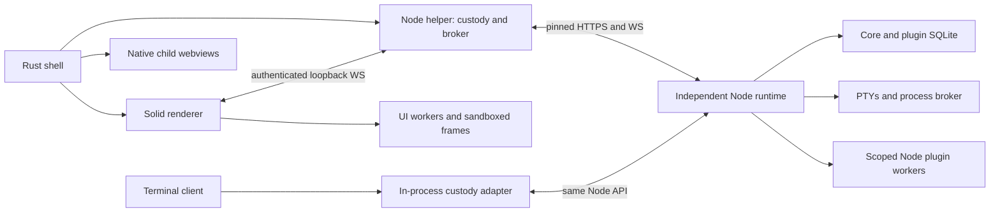

# Acorn performance investigation

Started September 30, 2026, against `f8e4b59caadfe846a9e2c6491ac42b91ec3cf66f`.
Status: units 01–08 implemented and reviewed; commit checkpoint requested October 1, 2026.
All 16 investigations are complete. Units 09–28 and sustained-use validation remain pending.
Implementation agents run sequentially. The complete repository tests and lint pass at this checkpoint.

The target is responsive task, workspace, terminal, and plugin navigation throughout sustained
use. Improvements must preserve node isolation, plugin containment, portable client contracts,
persisted state, and the extension points proposed under `docs/future/`.

## Runtime map

The desktop Rust shell creates the window after the Node helper opens its loopback broker.
The helper starts and supervises the local Node behind the loading screen. Each Node owns its
SQLite databases, execution environment, PTYs, Git operations, schedules, and plugin runtime.
The Solid renderer owns presentation, query caches, device preferences, and retained pane state.
The terminal client composes custody in the same process while keeping presentation boundaries.

Product reads follow renderer or terminal client -> platform transport -> custody broker ->
authenticated Node API -> core or plugin storage and runtime. Events return through the Node
WebSocket, broker, client fanout, cache or store, and the visible UI. Compiled plugins receive
explicit extra seams; loaded Node plugins run in workers. Loaded UI uses remote component trees
or sandboxed frames. Performance changes belong at the owner of the unnecessary work.

## Investigation sequence

| Area | Scope | Status |
| --- | --- | --- |
| 01 | [Desktop, helper, and Node startup](./01-startup.md) | Investigated; two measured candidates |
| 02 | [Node plugin workers, isolation, IPC, and disposal](./02-node-plugins.md) | Investigated; three measured findings |
| 03 | [Client plugin loading, remote trees, frames, and registrations](./03-client-plugins.md) | Investigated; three measured findings |
| 04 | [PTYs, terminal attachment, xterm, and retained terminals](./04-terminals.md) | Investigated; three measured candidates |
| 05 | [Fleet broker, HTTP and WebSocket transport, fanout, and backpressure](./05-transport.md) | Investigated; six measured candidates |
| 06 | [Query cache, persistence, invalidation, and cache memory](./06-cache.md) | Investigated; four measured candidates and body-retention follow-up |
| 07 | [Task and workspace navigation, panes, chrome, and reactive UI churn](./07-navigation.md) | Investigated; three measured candidates |
| 08 | [Agent client streaming, transcript projection, and rendering](./08-agent-client.md) | Investigated; three immediate candidates and two conditional follow-ups |
| 09 | [Agent Node runtime, event storage, search, and process lifecycle](./09-agent-node.md) | Investigated; eight measured handoffs |
| 10 | [Diff rendering, virtualization, highlighting, and large content](./10-diff-highlight.md) | Investigated; four measured handoffs |
| 11 | [Git reads, repository polling, filesystem services, and worktrees](./11-git-filesystem.md) | Investigated; six measured handoffs |
| 12 | [Editor documents, file trees, search, and view retention](./12-editor.md) | Investigated; eight measured handoffs |
| 13 | [Preview webviews and tunnels, Docker, database, and HTTP panes](./13-services.md) | Investigated; twelve measured handoffs |
| 14 | [Schedules, integrations, dashboards, workflows, and background work](./14-background.md) | Investigated; six measured handoffs |
| 15 | [Terminal client startup, cell rendering, input, and subscriptions](./15-tui.md) | Investigated; seven measured handoffs |
| 16 | [Telemetry overhead, retention, memory ownership, and sustained-use checks](./16-ownership.md) | Investigated; five measured handoffs |

Each report records inspected paths, prior changes, evidence, proposed fixes, a reproducible
measurement, behavioral risks, future-plan compatibility, and rejected or uncertain ideas.
After all investigations, findings are reviewed and deduplicated before implementation.

## Evidence policy

Recent performance work includes terminal retention, incremental transcript projection, narrower
agent updates, conditional patch hydration, worker startup concurrency, lazy imports, bounded
agent snapshots, compile caching, and reusable synchronous worker buffers. Commit messages hold
their measurements. Investigations evaluate the checkout rather than reintroducing those changes.

Sentry organization: `acorn-u3`; project: `acorn-development`. September 30 traces are available,
but sampled records inspected during reconnaissance carry no release identifier. Older span
aggregates are leads and cannot establish the effect of changes on this checkout.

Measure the same workload before and after a fix. Report process CPU, retained memory, operation
counts, transfer size, and elapsed time where appropriate. Distinguish production bundles, debug
shells, synthetic fixtures, actual webview measurements, and unavailable measurements. A short
stress run cannot prove several days of uninterrupted use.

## Validation

Run `pnpm lint`, relevant focused tests, and the bounded `pnpm test` suite. Renderer changes require
an isolated real Tauri session using `pnpm dev:agent`, followed by snapshots and screenshots.
Record limitations and stop the test session at completion. Do not create branches or commits.
The [native validation notes](./native-validation-notes.md) record the isolated bundle attempts,
verified SDK activation, baseline driver timeouts, and the limits of the hidden macOS test window. A separate original
source archive supports paired owner probes. No normal profile may be launched or changed for that
check.

## Results

The [implementation sequence](./implementation-plan.md) groups the selected findings into 28
sequential units. [Accepted performance results](./implementation-results.md) summarizes reviewed
units, measured gains, and disclosed costs. The
[sustained validation plan](./sustained-validation-plan.md) defines the final mixed-use gate.

The [verification baseline](./baseline.md) records setup, Sentry limitations, and the initial live
session. [Startup investigation](./01-startup.md) found repeated durable writes on unchanged Node
packages and per-package client custody commits. The [startup implementation](./implementation-01-startup.md)
removes exact-repeat ownership writes and batches successful cache and trust commits. Five paired
rounds measured unchanged reconciliation at 49.7 ms before and 11.4 ms after, with eight fsyncs
reduced to zero. Cold client custody measured 96.9 ms before and 36.2 ms after, with fourteen fsyncs
reduced to two. These are source-owner timings against identical bundled bytes, not visible launch
latencies. The coordinator independently replayed the unchanged reconciliation and reviewed the
diff and focused gates. Cumulative desktop gates pass through unit 06. Isolated native Notes/Shell
checks pass through unit 05; unit 06 records actual HTTP rendering and draft recovery with a focus
limitation. Final repository, reliable focused navigation, and sustained-use checks remain pending.

The [accumulated verification record](./verification.md) tracks coordinator gates. The repository
lint and typechecks pass through unit 07. Final whole-suite and native gates remain
pending as the sequential implementation continues.

The [Node plugin investigation](./02-node-plugins.md) reproduced linear RPC reference retention,
workers surviving rejected reloads, and cancellation lost from forwarded Requests. Independent
coordinator probes confirm the reference and worker retention. The implementation below repairs
those owners.

The [Node plugin implementation](./implementation-02-node-plugins.md) retires completed request
authority, visitors, and closed spans, terminates rejected candidates, and forwards cancellation.
At 21,000 synthetic routes, retained heap falls from 108.6 MB to 22.3 MB. CPU rises 28%, about
15.8 microseconds per route. This is a measured memory and lifetime repair, not a CPU or visible
latency improvement. The coordinator reviewed the diff and focused gates and independently
confirmed zero completed request references, listeners, and pending calls. Cumulative gates remain
pending.

The [client plugin investigation](./03-client-plugins.md) reproduced frame subscriptions surviving
pane disposal, obsolete remote event closures retained by live roots, and unchanged loaded panes
being removed and registered again. Independent coordinator probes confirm the handler retention
and frame/registry counts. Some original provider fixtures have invalid split-runtime aliases;
fresh unit06 ordinary-provider measurements supersede those results.

The [client plugin implementation](./implementation-06-client-plugins.md) closes retired frame
resources, releases obsolete SDK handlers, skips equivalent contribution refreshes, and separates
shared module lifetime from mounted authority. A 20-plugin unchanged refresh removes 40 observer
runs and 20 mounts/unmounts per pass; median CPU falls from 3,280.5 to 382 microseconds. Modern slots
share one worker with independent bridges; legacy contexts retain compatibility at an explicit
worker cost. Root verifies the final source/evidence hashes, replays seven concurrent/warm view
lifetimes, and stages the repaired SDK and first-party bundles. Native startup/draining fixtures,
document fencing, compatibility, and the real-window focus limit are recorded separately.

The [terminal investigation](./04-terminals.md) measured tiny-chunk ring overhead, reproduced
overlapping run-target starts leaving extra processes, and confirmed missing structural roster
notifications. The coordinator replayed the ring, service, and engine probes. Parser-credit
changes require further live evidence.

The [terminal implementation](./implementation-07-terminals.md) uses bounded byte blocks, orders
run-target operations, publishes roster changes, and retires Node-owned attachments and timers.
Eight-byte saturated output reduces retained heap from 3,730,424 to 82,192 B and overflow CPU from
106.087 to 2.233 ms. Ordinary initial fill has a small overhead; xterm replay has no measured gain.
The root replay passes 47 focused tests, including real private tmux and temporary SQLite gates.
Durable sessions survive ordinary shutdown. Repository lint passes all 34 tasks through unit 07;
native terminal and sustained-use gates remain pending.

The [transport investigation](./05-transport.md) reproduced active event loss after fleet reads,
renderer-owned requests surviving disconnect, pre-aborted requests still running, and obsolete
terminal subscriptions amplified on reconnect. It measured compatible helper encoding and response
copy reductions. Independent coordinator probes confirmed the main results. Shared fanout deadlines
must preserve another observer's request; downstream producer credits need further live evidence.

The [transport implementation](./implementation-03-transport.md) gives each renderer independent
event ownership and releases its resources on close. The paired authenticated fixture reduces
inactive forwarding from 128 frames to zero and helper encoding of 8 MiB from 207.6 ms to 1.3 ms.
The coordinator independently confirms fresh terminal restores, sibling survival, latest-size
reconnect, final resource release, exact bytes, and zero surviving fixture processes. HTTP assembly
removes one body-sized copy but shows no timing improvement. Legacy compatibility, added viewer
headers, and the remaining navigation and native gates are recorded separately.

The [cache investigation](./06-cache.md) found full-cache dehydration before the write throttle,
pending writes surviving Node removal, preference effects spanning unrelated slices, and device
preference scans across unrelated storage keys. The coordinator independently replayed the main
counts and CPU growth. Originating-Node save custody, rollback queues and debounce reversion are
correctness prerequisites. Body eviction requires a separate navigation and offline-data decision.

The [cache implementation](./implementation-04-cache.md) coalesces snapshot capture before
dehydration and owns partition retirement and preference custody. The matched 3,000-query fixture
reduces full-window CPU from 1,791.5 ms to 138.0 ms, with unchanged final snapshot bytes and
invalidation state. Device preference key enumeration falls from 40,040 calls to zero; slice changes
stop serializing unrelated slices. Independent coordinator replays confirm the counts, data and
retirement. Focused renderer restore and real TUI boot gates pass. The first cache capture now waits
up to five seconds; dirty preference acknowledgement retains its separate policy. Native latency,
complete TUI Node switching and sustained-use gates remain pending.

The [navigation investigation](./07-navigation.md) reproduced cross-Node pane-model reuse,
incoming model disposal before teardown completed, and inactive terminal sinks preventing return
snapshots. It measured repeated rail-order parsing. The coordinator replayed the four owner probes;
deep hierarchy restructuring remains conditional on representative depth.

The [agent client investigation](./08-agent-client.md) reproduced stale asynchronous reads crossing
Node boundaries, deferred composer hydration affecting a replacement session, and repeated full
image reads. The coordinator replayed all six cases. Streamed rows remain stable; long-message
parsing and large-history initial DOM need visible-renderer follow-up before architectural changes.

The [agent Node investigation](./09-agent-node.md) measured history-sized queue scans, provider
handles started before admission, repeated discovery probes, growing-head indexing, and wait reads.
It reproduced native process cleanup gaps and completeness/pagination failures. All seven probes
passed the coordinator replay; synthetic process cleanup left zero live PIDs. Indexing and process
changes have explicit search, migration, and platform ownership gates.

The [diff investigation](./10-diff-highlight.md) reproduced duplicate cold workers, remounted
overlapping virtual rows, obsolete and duplicate fence highlights, and stale expanded context.
The coordinator replayed all ten cases. Large settled fences and append-aware parsing remain
conditional on visible renderer evidence; the immediate ownership repairs preserve the existing
hydration, model, grammar and virtualization contracts.

The [Git investigation](./11-git-filesystem.md) reproduced stale HEAD observations, unbounded
filesystem stamp admission, repeated PR comparison commands, expired stdout retention, quoted-path
failures, and incomplete untracked patches. The coordinator replayed all six findings. Fresh disk
stamps and refusal checks remain required; a Node-wide Git budget is conditional on further load.

The [editor investigation](./12-editor.md) reproduced retained superseded previews, overlapping and
misrouted saves, premature host flush acknowledgement, stale reloads and markers, silent read
failures, search overflow, and an unbounded file-tree DOM. Save custody and dirty-buffer retention
precede document lifetime changes. The file editor's supported size policy remains separate from
the loaded document bridge's existing limit. The coordinator replayed all eleven renderer cases;
Node search/body evidence remains the specialist's actual service probe.

The [services investigation](./13-services.md) measured duplicate PG pool/catalog work, discarded-row
normalization, costly log-tail maintenance and HTTP decoding. It reproduced failed Docker stream
slots, cross-Node Docker state, HTTP draft/cancellation races, scratch byte-limit disagreement,
late tunnel publication and preview resolution fanout. The coordinator replayed all sixteen Vitest
cases plus real failed-spawn and loopback-listener probes. Driver-level SQL buffering, native preview
retention and request-list projection remain gated by their missing semantic and native evidence.

The [background investigation](./14-background.md) measured repeated Memory index rebuilds,
unused workflow history/detail reads, overlapping refreshes, and retained copies of streamed output.
It reproduced authoring cleanup sent to the incoming Node. The coordinator replayed all four
renderer cases and three Node workloads; [the verification record](./14-coordinator-verification.txt)
preserves counts and limits. Fresh file authority, exact workflow counts, canonical outputs, and
unsent recovery remain required.

The [terminal-client investigation](./15-tui.md) measured quadratic collection movement and word
wrapping, excessive clipped painting, hidden virtual-list expansion, and retained Log nodes. It
reproduced fixed-Node provider custody and graphical editor work on the terminal host. The
coordinator replayed all eleven cases; shared cache removal also has a real TUI adapter gate.

The [ownership investigation](./16-ownership.md) reproduced stale pooled worker authority, shared
viewer retirement errors, unconsumed terminal worker output, failed startup resources, and telemetry
reactivation after disposal. The coordinator replayed all five focused cases and both owner scripts.
Returned telemetry handles extend the RPC gates rather than adding a separate leak unit.

The [candidate ledger](./candidate-ledger.md) groups measured handoffs and dependencies. The
[implementation plan](./implementation-plan.md) selects 85 handoffs in 28 sequential units and a
telemetry capacity repair. Conditional changes retain their evidence and behavioral gates.

`live-probe.mjs` reads renderer counters and seeds a disposable non-Git workload through the broker.
`resource-probe.mjs` samples the isolated app's process subtree without reading command arguments.

## Leads recorded during investigation

These source observations guided the completed investigations. The linked area reports and
implementation plan own their resulting evidence and selection.

- Area 07: `paneModels.ts` holds one task per pane, captures the constructing QueryClient context,
  and currently handles task eviction only. Check disposal on Node changes, delayed saves, and
  colliding task IDs alongside navigation churn. Preserve each pane's durable view state.
  Also inspect terminal subscription teardown on a Node change: `wsChannel.ts` clears its local
  attachment map, and its disposer sends detach only while the original Node remains active.
  Determine whether a still-connected broker leaves server display sinks attached after a switch.
  Include Solid's synchronous provider swap and eviction ordering in the characterization.
- Area 09: the live subtree briefly included a provider CLI and MCP grandchildren. Inspect usage
  collectors separately from paid agent turns: `claudeUsage.ts` launches `/usage`, and
  `claudeDailyUsage.ts` rereads recent JSONL files after each usage refresh. Use synthetic histories
  and fixtures; do not inspect private transcripts or run paid work for measurements.
- Area 10: inspect concurrent cold `tokenizeDocument` calls. `highlight/worker.ts` awaits its worker
  constructor import before assigning the singleton, without an in-flight spawn promise. Determine
  whether actual concurrent hydration can create extra workers; cover failure and timeout ownership.
- Area 16: area 03 found that a cached UI worker's host bridge can capture its first tree's binding,
  Node and document accessors. Characterize first-slot disposal followed by warm reuse across tasks,
  Nodes and documents before proposing a longer worker grace period.
  Also characterize two authenticated renderer sockets attaching one terminal through the same
  helper/NodeBroker, then one detaching or disconnecting. The hub sink belongs to the broker's Node
  socket; per-renderer cleanup must preserve any other live viewer. This is a source-level lead,
  not evidence that the current single-window desktop routinely encounters it.
  Area 13 traced the same coupling for Docker: its server stream subscriptions use the shared Node
  connection plus stream kind/container. One renderer's detach can stop another viewer's stream.
  Cover that through a shared ownership seam rather than adding plugin channel names to the helper.
- Area 16: telemetry's loaded-plugin RPC surface includes `startSpan().end()` and visitor-shaped
  `measure`. Characterize returned-handle and callback lifetimes alongside area 02 before claiming
  a shipped workload leak; no first-party calls were found in the root's narrow search. The
  renderer's `setSpansOnTimeline` intentionally retains User Timing entries only behind the
  development performance switch and is off by default. Distinguish that instrumentation policy
  from ordinary production telemetry when designing sustained-use measurements.
